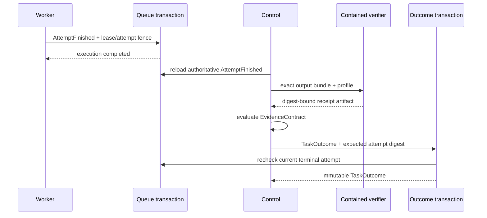

# ADR 0006: Control-Owned Task Outcomes

- Status: Accepted
- Date: 2026-07-21
- Supersedes: the shadow-only outcome portion of ADR 0004

## Context

The Worker previously copied `AgentResult.success` into `CodingJobResult.success`
and selected the queue's `completed` or `failed` terminal state from that value.
The independent Control evidence service could verify the exact output bundle and
evaluate an `EvidenceContract`, but its result was not durable authority. This
made execution termination look like semantic task completion and left no fenced
transaction that could reject a stale attempt.

## Decision

Execution state and semantic state are separate projections:

1. A Worker may publish only `AttemptFinished`. It contains job/attempt identity,
   immutable source and output bundle references, and the complete `AgentResult`
   as diagnostic lineage. It has no task-success field.
2. `jobs.status = completed` means that the current leased execution published a
   structurally valid attempt result. It does not mean that the task passed.
3. `attempt_finished` is append-only. The lease owner, non-expired lease, and
   current attempt number are checked in the same transaction that releases the
   lease and writes the record.
4. Control reloads the current authoritative attempt, independently verifies its
   exact output bundle, re-reads the receipt artifact, evaluates the immutable
   contract, and maps the three-valued result to `passed`, `failed`, or
   `indeterminate`.
5. Only the Control-owned `TaskOutcomeAuthorityPort` implementation may insert a
   `task_outcomes` row. Publication rechecks job status, current attempt number,
   attempt digest, queue projection, source/output bundles, contract, profile,
   request, receipt, observation set, and evaluation bindings.
   The immutable contract, profile, and complete `ContractEvaluation` are stored
   in the outcome payload so the decision does not depend on later file presence.
6. Attempt and outcome rows reject update and delete operations with SQLite
   triggers. A repeated identical Control request is idempotent; different inputs
   for a job with an outcome are rejected.
7. Final Control verification always uses `DockerVerifierTransport`, including
   when direct Agent execution was explicitly configured as trusted in-process.

## Compatibility

`CodingJobResult` remains importable and parseable as a legacy v1 contract, but
new Worker, Control, and evidence-adjudication paths do not consume it. The
low-level `queue-finish` command remains available for queue diagnostics; a
generic completion cannot create `AttemptFinished` authority and therefore
cannot produce a `TaskOutcome`.

## Consequences

- Agent success and queue terminal state cannot grant semantic completion.
- Expired Workers cannot publish attempt lineage after a reclaim.
- Operators can inspect all three projections with `task-status` and invoke the
  authority transition with `task-adjudicate`.
- The current authority is repository-local SQLite under the Git common
  directory. It is not an external append-only ledger or multi-tenant identity
  system.
- Task graph dispatch IDs, admitted TaskBasis authority, signed outcome events,
  and automatic Gap closure remain separate follow-up work.
