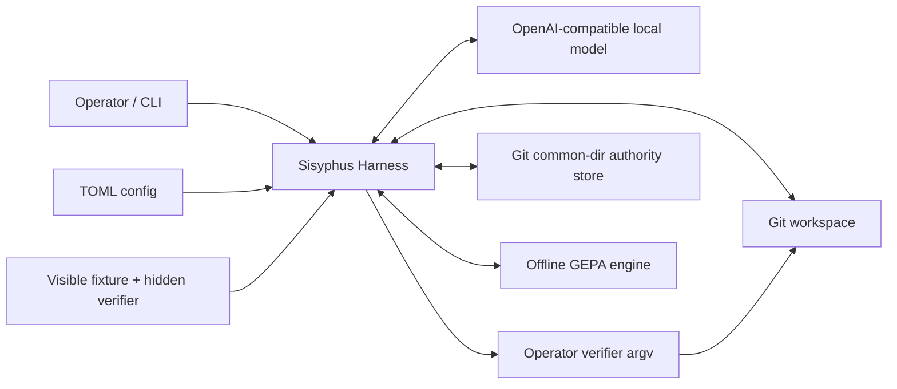
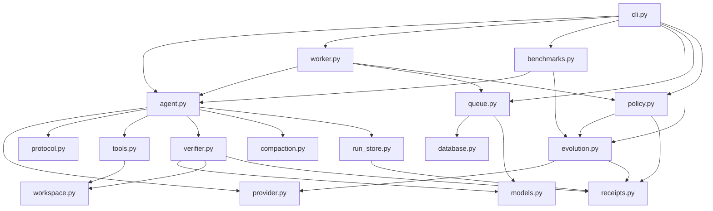
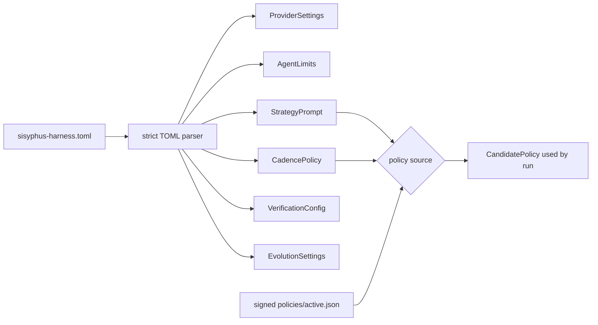
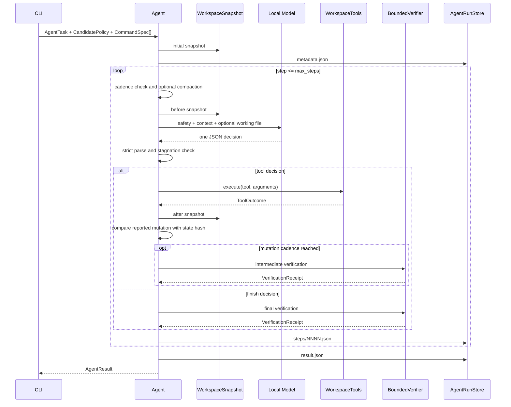
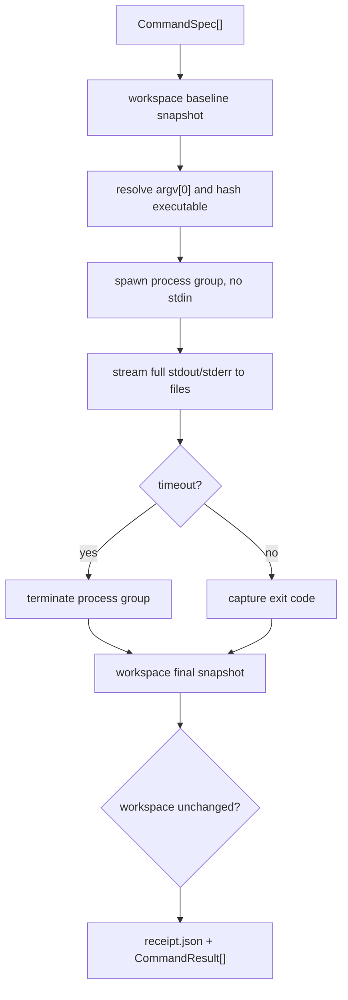
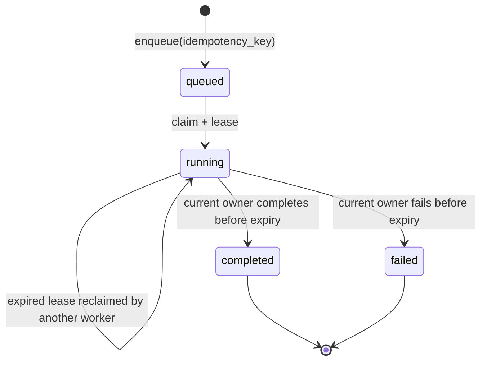
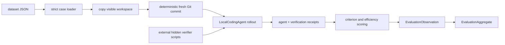
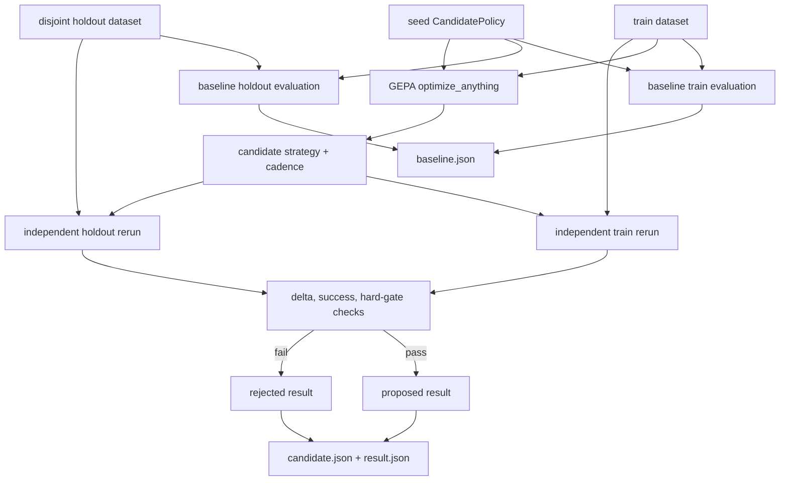
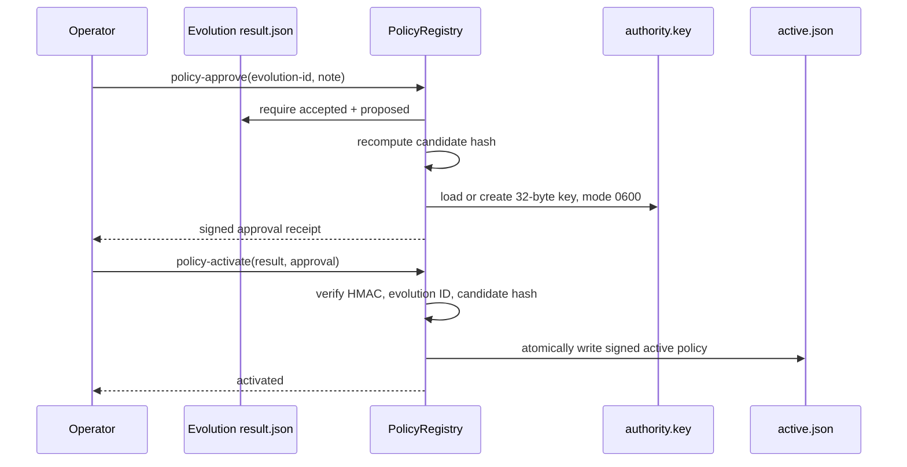

# Architecture and Data Pipeline

이 문서는 Sisyphus Harness의 실제 구현을 기준으로 논리적 아키텍처,
신뢰 경계, 런타임 데이터 모델, 영속화 구조, 직접 실행·큐·benchmark·evolution
파이프라인을 하나의 관점으로 정리한다. 분석 기준은 런타임 소스가 마지막으로
변경된 `main` 커밋 `47539e0` 이후의 코드이며, 문서 및 evidence 변경은 동작에
영향을 주지 않는다.

기존 [`architecture.md`](architecture.md)는 짧은 개요이고,
[`evolution.md`](evolution.md)는 evolution 정책만 다룬다. 이 문서는 운영자가
입력한 데이터가 어느 경계를 통과하고, 어떤 검증을 거쳐, 어디에 저장되며,
다음 단계에서 어떻게 소비되는지를 상세히 설명한다.

## 1. 시스템 목적과 경계

Sisyphus Harness는 Git 저장소 하나를 대상으로 로컬 coding model을 제한된
파일 도구와 operator verifier 사이에서 실행하는 repository-local control
plane이다. 핵심 설계 목표는 다음 네 권한을 분리하는 것이다.

1. **모델 추론 권한**: 다음 행동을 JSON으로 제안한다.
2. **workspace 변경 권한**: harness가 허용한 여섯 파일 도구만 실행한다.
3. **검증 권한**: operator가 TOML에 정의한 argv만 실행하고 receipt를 만든다.
4. **정책 활성화 권한**: evolution 결과와 별도로 operator 서명 승인을 요구한다.

모델은 shell, 임의 network tool, Git lifecycle, merge, release, queue 전이,
정책 승인·활성화 권한을 갖지 않는다. 다만 OpenAI-compatible provider 자체는
HTTP endpoint이며, verifier는 operator 계정으로 실행되므로 이 시스템은
process sandbox가 아니다.



## 2. 논리적 아키텍처

물리적으로는 `src/sisyphus_harness` 아래의 runtime 모듈과 `contracts`, `ports`
하위 package로 구성된다. 책임은 다음 다섯 논리 계층으로 나뉘며, 이 표는
디렉터리 모양보다 실제 의존 방향을 설명한다.

| 논리 계층 | 모듈 | 책임 |
| --- | --- | --- |
| Interface | `cli.py` | 명령 파싱, 경로 해석, object 조립, JSON 출력과 exit code |
| Application orchestration | `agent.py`, `worker.py`, `benchmarks.py`, `evolution.py` | 직접 실행 loop, leased job 실행, 격리 평가, 후보 최적화 및 판정 |
| Contracts and policy | `contracts/`, `ports/`, `models.py`, `config.py`, `protocol.py`, `compaction.py`, `policy.py` | versioned dataclass, service port, TOML validation, model decision schema, deterministic context reduction, 승인 정책 |
| Execution adapters | `provider.py`, `tools.py`, `verifier.py` | HTTP chat completion, bounded workspace 도구, subprocess 검증 |
| Persistence and boundaries | `authority.py`, `database.py`, `queue.py`, `workspace.py`, `receipts.py`, `run_store.py` | Git common-dir authority, SQLite transaction, lease state, path/snapshot, atomic artifacts |

### 2.1 모듈 의존 구조



### 2.2 주요 조립 지점

`cli._main()`이 command별 composition root다. 직접 실행에서는 config,
provider, verifier, artifact root, policy를 조립해 `LocalCodingAgent`를 만든다.
큐 실행에서는 `CodingWorker`가 동일한 조립을 job claim 이후 수행한다.
benchmark와 evolution도 같은 `LocalCodingAgent`를 사용하므로 실제 코딩 loop가
별도로 복제되지 않는다.

향후 container 분리의 책임, workspace 전달, verification authority, queue와
artifact 소유권은 [`docs/adr`](adr/)에 고정되어 있다. 기존 module import 경로는
호환 alias이지만 새 코드의 wire type은 `contracts`에서 가져오고 concrete
service 대신 `ports`에 의존한다.

### 2.3 CLI 진입점과 pipeline

| 명령 | 시작하는 동작 | 주요 영속화 |
| --- | --- | --- |
| `init` | authority DB schema 초기화 | `authority.sqlite3` |
| `queue-enqueue` | 임의 kind/payload의 low-level enqueue | SQLite job row |
| `queue-claim` | low-level lease claim/reclaim | job status와 lease |
| `queue-heartbeat` | 현재 owner의 lease 연장 | lease expiry |
| `queue-finish` | low-level completed/failed 전이 | terminal `result_json` |
| `queue-get` | job 조회 | 없음 |
| `task-submit` | typed `coding-agent` payload enqueue | SQLite job row |
| `worker-once` | job 하나 claim, agent 실행, terminal 전이 | queue + agent/verifier artifacts |
| `verify` | 선택된 operator command 실행 | verification artifacts |
| `agent-run` | 직접 coding loop 실행 | agent + verification artifacts |
| `benchmark-run` | dataset 전체의 격리 rollout 평가 | rollout artifacts; aggregate는 stdout |
| `evolve` | baseline, GEPA, candidate 재평가 | evolution + rollout artifacts |
| `policy-approve` | proposed candidate에 operator 승인 | signed approval JSON |
| `policy-activate` | 승인과 candidate를 검증해 active 설정 | signed `active.json` |
| `policy-show` | active signature 검증 및 candidate 출력 | 없음 |

모든 명령은 stdout 또는 stderr에 JSON을 출력한다. 정상 완료는 0, 정상적으로
실행됐지만 agent·verification·benchmark·evolution 결과가 gate를 통과하지 못한
경우는 1, parsing·configuration·runtime exception은 구조화된 error와 exit 2를
사용한다.

## 3. 핵심 데이터 계약

| 데이터 | 구현 타입 또는 schema | 생성자 | 주요 소비자 |
| --- | --- | --- | --- |
| Harness 설정 | `HarnessConfig` | `load_harness_config()` | CLI, worker, agent, evolution |
| 작업 요청 | `AgentTask` | CLI 또는 `CodingJobPayload` | `LocalCodingAgent.run()` |
| 모델 메시지 | `ChatMessage` | agent 또는 GEPA adapter | `ChatProvider.complete()` |
| 모델 응답 | `ChatResponse` | provider | agent protocol parser 또는 GEPA reflection adapter |
| 모델 행동 | `AgentDecision` | `parse_agent_decision()` | workspace tool 또는 final verifier |
| 도구 결과 | `ToolOutcome` | `WorkspaceTools.execute()` | agent event와 다음 prompt |
| workspace 상태 | `WorkspaceSnapshot` | `snapshot_workspace()` | mutation 대조, stagnation, receipt |
| 검증 명세 | `CommandSpec` | TOML parser 또는 benchmark case | `BoundedVerifier` |
| 검증 결과 | `VerificationReceipt` | `BoundedVerifier.verify()` | agent, benchmark, operator |
| agent 결과 | `AgentResult` | `LocalCodingAgent._finish()` | CLI, queue terminal result, benchmark scorer |
| queue row | `JobRecord` | `JobQueue` | CLI, worker |
| 정책 후보 | `CandidatePolicy` | config 또는 GEPA | benchmark, approval, active run |
| 단일 평가 | `EvaluationObservation` | benchmark evaluator | GEPA와 aggregate |
| 평가 집계 | `EvaluationAggregate` | evolution evaluator | baseline/candidate 비교 |
| evolution 결과 | `EvolutionResult` | `EvolutionRunner` | operator approval |

모든 외부 입력 parser는 unknown field를 거부한다. config 숫자는 finite 여부와
범위를 검사하고, agent criterion은 선택된 verifier command의 criterion 문자열과
정확히 일치해야 한다. 이 문자열 binding이 task 성공과 무관한 검증 명령이
성공을 부여하는 것을 막는다.

## 4. Authority와 저장 구조

authority root는 현재 worktree의 `.git` 경로가 아니라 다음 명령의 결과를
기준으로 계산한다.

```text
git rev-parse --git-common-dir
```

따라서 linked worktree들은 동일한 queue, 정책, artifact 저장소를 공유한다.
authority path가 common directory 밖으로 resolve되면 초기화가 실패한다.

```text
<git-common-dir>/sisyphus-harness/
├── authority.sqlite3
├── artifacts/
│   ├── agent/
│   │   └── <run-id>/
│   │       ├── metadata.json
│   │       ├── steps/0001.json
│   │       ├── compactions/0001.json
│   │       └── result.json
│   ├── verification/
│   │   └── <verification-run-id>/
│   │       ├── receipt.json
│   │       └── 00-<command>/
│   │           ├── stdout.txt
│   │           └── stderr.txt
│   └── evolution/
│       ├── <evolution-id>/
│       │   ├── baseline.json
│       │   ├── candidate.json
│       │   ├── result.json
│       │   └── gepa/
│       ├── <evolution-id>-rollouts/
│       └── benchmark-rollouts/
└── policies/
    ├── authority.key
    ├── approvals/<evolution-id>-<hash-prefix>.json
    └── active.json
```

JSON과 text receipt는 같은 디렉터리에 임시 파일을 쓰고 `fsync`, `os.replace`,
directory `fsync` 순서로 원자 저장된다. run ID와 evolution ID는 제한된 문자
집합으로 검증되고 기존 run directory를 덮어쓰지 않는다.

### 4.1 SQLite job schema

`authority.sqlite3`의 `jobs` row는 다음 정보를 가진다.

| 필드 | 의미 |
| --- | --- |
| `job_id` | 서버가 생성한 UUID 기반 식별자 |
| `idempotency_key` | 요청 중복 방지용 unique key |
| `kind` | worker dispatch 종류, 현재 typed worker는 `coding-agent`만 지원 |
| `payload_json` | canonical JSON으로 저장된 요청 payload |
| `status` | `queued`, `running`, `completed`, `failed` |
| `lease_owner`, `lease_expires_at` | running 상태의 현재 소유자와 만료 epoch |
| `attempts` | claim 또는 expired lease reclaim 횟수 |
| `result_json` | completed/failed terminal 결과 |
| `created_at`, `updated_at` | UTC ISO-8601 audit 시간 |

SQLite는 WAL, foreign key, 30초 busy timeout을 사용한다. 쓰기 transaction은
`BEGIN IMMEDIATE`로 시작해 claim과 terminal transition의 경쟁을 직렬화한다.

## 5. 설정과 정책 해석 파이프라인

모든 주요 실행은 먼저 repository-contained TOML을 `HarnessConfig`로 변환한다.



- `--policy config`: TOML의 strategy와 cadence를 `CandidatePolicy`로 감싼다.
- `--policy active`: `active.json`의 HMAC을 검증하고 candidate를 복원한다.
- safety prompt, tool schema, limits, verifier command는 active policy가 바꾸지
  못한다.
- direct run은 config path를 해당 run의 model write-protected path로 등록한다.

큐의 `task-submit`은 config **내용**이나 active policy hash를 저장하지 않고
repository-relative config path와 `config|active` 선택만 payload에 넣는다.
따라서 config와 active policy는 submit 시점이 아니라 worker 실행 시점에
해석된다. job payload 자체는 immutable하지만 참조 대상은 그 사이 변경될 수
있다. 실제 실행 metadata에는 limits, cadence, strategy hash가 남고 verifier
receipt에는 실행 argv가 남지만, submit 당시 설정 snapshot을 보장하는 구조는
아니다.

## 6. 직접 agent 실행 파이프라인

### 6.1 시작 전 검증

`agent-run`은 다음 순서로 시작된다.

1. repo와 config 경로를 resolve하고 containment를 검사한다.
2. config 또는 signed active policy를 선택한다.
3. task와 중복 없는 acceptance criteria를 `AgentTask`로 만든다.
4. 모든 task criterion이 선택된 `CommandSpec.criteria`에 존재하는지 확인한다.
5. Git HEAD, staged/unstaged diff, untracked content로 초기 workspace snapshot을
   만든다.
6. 중복되지 않는 agent artifact directory를 만들고 `metadata.json`을 쓴다.

workspace는 반드시 Git repository와 유효한 HEAD를 가져야 하지만 clean할
필요는 없다. `AgentResult.changed_paths`는 run 이전 대비 delta가 아니라 최종
HEAD 대비 changed path 집합이므로, 시작 전에 존재한 변경도 포함될 수 있다.
초기·최종 `state_hash`를 함께 사용해야 run 중 변화를 정확히 구분할 수 있다.

### 6.2 step loop



각 prompt context에는 task, criterion, strategy, deterministic compact summary,
최근 event, 주기적 workspace observation, 알려진 file hash, criterion status,
reflection flag, cadence가 들어간다. 마지막으로 읽거나 쓴 working file의
내용은 JSON escape로 손상되지 않도록 별도 user message에 최대 4,000자까지
verbatim으로 전달된다.

provider는 `/chat/completions`에 non-streaming request를 보내며 strict JSON
response schema를 요청한다. response body는 16 MiB로 제한되고, 반환된 content는
다시 harness parser와 tool argument validator를 통과한다.

### 6.3 여섯 workspace 도구

| 도구 | 읽기/쓰기 | 핵심 제약 |
| --- | --- | --- |
| `list_files` | 읽기 | Git tracked + non-ignored untracked 파일만, 출력 제한 |
| `read_file` | 읽기 | relative path, UTF-8 text, file byte limit, line 범위 |
| `search_text` | 읽기 | literal substring, 최대 200건, 전체 출력 제한 |
| `write_file` | 쓰기 | 기존 파일은 exact SHA-256, 신규 파일은 hash `null` |
| `replace_text` | 쓰기 | exact SHA-256, old fragment가 정확히 한 번 존재 |
| `delete_file` | 쓰기 | exact SHA-256, regular file만 |

공통 제약은 다음과 같다.

- absolute path와 parent escape를 거부한다.
- `.git`과 `.sisyphus-harness` path component를 거부한다.
- write 경로의 중간 symlink와 symlink target을 거부한다.
- config처럼 run이 지정한 protected path를 읽을 수는 있지만 쓸 수 없다.
- 기존 mode를 보존한 임시 파일과 `os.replace`로 원자 변경한다.
- tool의 `mutated` 값과 before/after workspace hash가 다르면 run을 실패시킨다.

### 6.4 context compaction과 stagnation

compaction은 LLM summarization이 아니라 deterministic reducer다. 오래된 event에서
tool count, 읽은/변경한 파일, 최근 error, 최신 verification을 누적하고 지정된
수의 최근 event는 그대로 유지한다. step interval 또는 serialized context char
limit 중 하나가 충족되면 실행되며 각 결과는 별도 compaction receipt에 남는다.

stagnation은 두 방식으로 차단한다.

- reason text를 제외한 decision fingerprint가 연속 반복되는 경우
- workspace state와 criterion status 조합이 이전 상태로 순환하는 경우

각 threshold는 cadence policy의 `stagnation_limit`을 사용한다.

### 6.5 종료 조건

성공은 model의 `finish`가 아니라 final `VerificationReceipt.passed`로 결정된다.
동일한 workspace state에서 이미 실패한 final verification을 다시 요청하면
검증을 재실행하지 않고 수정을 요구한다. 다음 조건은 fail-closed result를 만든다.

- provider failure 또는 protocol error budget 초과
- runtime 또는 step budget 초과
- repeated decision 또는 workspace cycle stagnation
- tool error가 workspace를 변경한 상태로 종료
- verifier가 workspace를 변경
- final verification 실패 후 예산 소진

runtime budget은 각 step 시작에서 확인된다. provider와 verifier에는 각각 별도
timeout이 있지만 전체 agent deadline이 subprocess를 선점 중단시키는 hard
deadline은 아니다.

## 7. Verification 파이프라인

`BoundedVerifier`는 shell string이 아니라 `CommandSpec.argv`를 직접
`subprocess.Popen`에 전달한다. shell metacharacter는 일반 인자로 취급된다.



command별 pass 조건은 launch 성공, timeout 없음, exit code 0, workspace unchanged를
모두 만족하는 것이다. run 전체는 모든 command가 pass하고 run 전후 workspace가
같아야 pass한다. failure는 `launch_error`, `timeout`, `workspace_mutation`,
`execution_error`, `assertion_failure`, `command_failure`로 분류된다.

receipt에는 argv, criterion, duration, exit code, timeout, executable path와
`argv[0]` hash, stdout/stderr 상대경로, command 및 run 전후 workspace hash가
포함된다. script가 `argv[1]`에 있는 경우 그 script hash까지 자동으로 provenance에
포함하지는 않는다.

Verifier는 model tool은 아니지만 model이 변경한 코드를 operator 계정으로 실행할
수 있다. `PYTHONDONTWRITEBYTECODE=1`과 mutation detection은 제공되지만 filesystem,
process, network sandbox는 제공하지 않는다.

## 8. Queue와 worker 파이프라인



### 8.1 제출

`task-submit`은 다음 payload를 canonical JSON으로 저장한다.

```json
{
  "task": "coding instruction",
  "criteria": ["verbatim criterion"],
  "config": "repository-relative-config.toml",
  "policy": "config|active",
  "run_id": "optional-run-id"
}
```

동일 idempotency key와 동일 kind/payload는 기존 job을 반환한다. 같은 key에 다른
요청을 넣으면 conflict다.

### 8.2 claim과 실행

worker는 가장 오래된 queued job 또는 만료된 running job 하나를 transaction
안에서 claim한다. `LeaseKeeper` thread는 lease 시간의 1/3 주기로 heartbeat하고,
worker는 payload를 strict parsing한 뒤 config와 policy를 해석해 직접 실행과 같은
`LocalCodingAgent`를 구동한다.

agent가 성공하면 `completed`, 실패하면 `failed`로 terminal transition한다.
exception도 구조화된 실패 result로 저장한다. terminal update는 현재 owner이며
lease가 아직 유효할 때만 성공한다.

lease는 SQLite row 전이를 fence하지만 이미 시작된 repository mutation을 취소하거나
격리하지 않는다. lease가 만료되어 다른 worker가 reclaim하면 두 실행이 같은
workspace를 만질 수 있으므로, 동시 운영에는 isolated worktree 또는 외부
per-repository lock이 필요하다. 이 경로의 delivery semantics는 workspace side
effect 기준으로 at-least-once다.

## 9. Benchmark 데이터 파이프라인

benchmark dataset은 case directory 목록을 담고, 각 `case.json`은 instruction,
criterion, visible workspace, criterion별 hidden verifier script를 정의한다.
verifier 순서와 criterion 순서는 정확히 일대일로 일치해야 한다.



평가마다 새 rollout directory를 만들고 visible workspace만 복사한다. `.git`,
`.sisyphus-harness`, bytecode cache는 제외하며 고정 author/committer timestamp로
초기 commit을 만든다. hidden verifier는 복사된 workspace 밖에 남지만 command
cwd는 rollout workspace이므로 그 workspace의 코드를 검사한다.

점수는 다음 식을 사용한다.

```text
score = 0.70 * criterion_pass_rate
      + 0.15 * success
      + 0.10 * step_efficiency
      + 0.05 * compaction_efficiency
```

- `criterion_pass_rate`: 각 criterion의 가장 최근 verification 상태
- `success`: final agent success 여부
- `step_efficiency`: max step 대비 적게 사용한 정도
- `compaction_efficiency`: max compaction 대비 적게 사용한 정도

verifier mutation이나 tool mutation mismatch는 hard-gate failure다. evaluator
exception은 score 0, success false, hard gate false인 observation으로 변환되어
나머지 case 평가를 계속할 수 있다. `benchmark-run` aggregate는 stdout JSON으로
출력되고, 각 rollout의 상세 receipt는 authority artifact에 남는다.

## 10. GEPA evolution 파이프라인

evolution이 변경할 수 있는 surface는 `strategy_prompt`와 schema-valid
`CadencePolicy`뿐이다. safety prompt, tools, path checks, limits, verifier, queue,
approval gate는 후보 데이터에 포함되지 않는다.



train과 holdout은 non-empty이고 각 set 안의 ID가 unique하며 서로 disjoint여야 한다.
baseline train/holdout을 먼저 기록한 다음 GEPA는 trainset을 optimization dataset과
GEPA valset으로 사용한다. GEPA evaluator는 rollout score와 함께 trace summary,
criterion 결과, success, hard gate, sub-score를 reflection side information으로
제공한다.

GEPA가 선택한 candidate는 engine 점수만 신뢰하지 않고 train과 holdout 전체에서
다시 실행된다. 다음을 모두 만족해야 `proposed`가 된다.

- train mean score가 baseline보다 `min_train_delta` 이상 개선
- holdout mean score가 baseline보다 `min_holdout_delta` 이상 개선
- holdout success rate가 baseline보다 낮지 않음
- 기본 설정에서는 모든 holdout case 성공
- train과 holdout의 모든 hard gate 통과

그 외에는 reasons를 가진 `rejected` 결과다. `proposed`도 아직 active policy가
아니다.

## 11. 승인과 활성화 파이프라인



approval은 candidate hash, evolution ID, username, UID, hostname, note, timestamp를
HMAC-SHA256으로 묶는다. activation은 승인 signature와 candidate binding을 다시
검사하고 active document 전체에 새 signature를 붙인다. active load도 signature를
검사하므로 파일 tampering은 실패한다.

이 HMAC은 같은 local authority root 안의 무결성 경계다. 외부 KMS, hardware key,
조직 identity attestation을 제공하지 않으므로 외부 신원 증명으로 해석하면 안 된다.

## 12. End-to-end 데이터 lineage

| 단계 | 입력 | 변환/검사 | 출력 | 영속화 위치 | 다음 소비자 |
| --- | --- | --- | --- | --- | --- |
| Config load | TOML | unknown field, type, finite/range validation | `HarnessConfig` | 없음 | CLI/worker |
| Policy resolve | config 또는 signed active file | candidate schema/hash/HMAC | `CandidatePolicy` | active file은 `policies/` | agent/benchmark/evolution |
| Task submit | task, criteria, config path, policy source | strict payload, canonical JSON, idempotency | `JobRecord` | SQLite `jobs` | worker |
| Agent prompt | task, policy, events, snapshots | cadence, compaction, observation | `ChatMessage[]` | step receipt에 복제 | provider |
| Model completion | OpenAI-compatible JSON | 16 MiB ceiling, JSON decision parse | `AgentDecision` | raw response in step receipt | tools/verifier |
| Tool execution | decision arguments | containment, hash, size, symlink, atomic write | `ToolOutcome` | step receipt | next prompt |
| Verification | `CommandSpec[]`, workspace | process timeout, exit, mutation check | `VerificationReceipt` | verification artifacts | agent/benchmark |
| Agent finish | initial/final snapshot, receipts | success/failure rule | `AgentResult` | agent `result.json` | CLI/queue/scorer |
| Benchmark | case + candidate | isolated rollout, score formula | `EvaluationObservation` | rollout artifacts | aggregate/GEPA |
| Evolution | seed, train, holdout | baseline, GEPA, independent rerun, gates | `EvolutionResult` | evolution artifacts | operator approval |
| Approval | proposed result | candidate hash + HMAC | approval receipt | `policies/approvals` | activation |
| Activation | result + approval | HMAC and binding verification | active policy | `policies/active.json` | later run |

## 13. 무결성과 일관성 제어

| 위험 | 구현 제어 |
| --- | --- |
| repository 밖 path 접근 | `Path.resolve()` 후 root-relative containment |
| symlink write escape | 중간 symlink 및 target symlink 거부 |
| stale model write | 현재 file SHA-256을 mutation argument로 요구 |
| 부분 파일/receipt | same-directory temp, fsync, atomic replace |
| tool의 거짓 mutation 보고 | workspace state hash before/after 대조 |
| verifier가 코드 변경 | command별 및 run 전체 snapshot 대조 |
| 무관한 verifier로 task 성공 | task criterion과 command criterion exact binding |
| 중복 queue 요청 | unique idempotency key + canonical payload 대조 |
| stale worker terminal write | owner와 unexpired lease 조건부 update |
| malformed model output | strict response schema, parser, protocol error budget |
| 반복/진동 | decision fingerprint와 state/criterion cycle limit |
| evolution의 안전 제어 약화 | candidate surface를 strategy/cadence로 제한 |
| 승인 후 candidate 변조 | candidate content hash와 HMAC binding |

`WorkspaceSnapshot.state_hash`는 HEAD commit, unstaged binary diff, staged binary
diff, untracked path와 file hash 또는 symlink target을 순서대로 SHA-256에 넣는다.
이 값은 semantic equivalence가 아니라 byte-level repository state identity다.

## 14. 관측성과 replay 자료

agent step receipt에는 full prompt messages, raw model response, parsed decision,
event, token count, duration, workspace before/after가 들어간다. 따라서 실행 판단을
사후 추적할 수 있지만 source content와 model output이 포함될 수 있으므로 artifact를
외부 공유하기 전 redaction이 필요하다.

verification stdout/stderr는 잘리지 않은 파일로 저장되고 agent에 되돌려주는
feedback은 category 중심으로 제한된다. benchmark diagnostics에는 action-oriented
trace summary와 rollout path가 포함되어 GEPA reflection이 실패 패턴을 사용할 수
있다.

완전한 byte-for-byte replay를 보장하는 event-sourcing 시스템은 아니다. 특히
provider model binary/hash와 전체 server 설정은 기본 agent metadata에 자동 기록되지
않고, queue submit 시점의 config snapshot도 저장하지 않는다. 재현성 주장이 필요한
실행은 repository의 evidence manifest처럼 model hash, server args, config, commit,
run artifacts를 별도로 묶어야 한다.

## 15. 성능 특성과 병목

- `snapshot_workspace()`는 대부분의 agent step 전후에 Git diff와 untracked scan을
  수행하므로 repository 크기와 변경량에 비례하는 orchestration 비용이 생긴다.
- `search_text`는 대상 UTF-8 파일을 Python에서 순차 scan하므로 총 repository byte에
  비례한다. index 또는 `rg` backend는 사용하지 않는다.
- full prompt와 raw response를 매 step JSON에 저장하므로 긴 run의 artifact 용량이
  빠르게 증가할 수 있다.
- artifact retention과 SQLite job pruning 정책은 구현되어 있지 않다.
- GEPA는 `parallel=False`이며 각 candidate/example가 실제 agent rollout을 수행하므로
  모델 latency가 전체 evolution 시간을 지배한다.

## 16. 운영상 명시적 한계

현재 구현의 안전한 적용 범위는 supervised, single-user, single-worker 실험이다.

1. verifier는 sandbox가 아니며 model-edited code를 operator 권한으로 실행한다.
2. queue lease는 DB 상태만 fence하고 repository side effect는 fence하지 않는다.
3. 전체 runtime budget은 hard deadline이 아니라 step-boundary budget이다.
4. verifier provenance는 executable `argv[0]`을 hash하지만 모든 script argument나
   dependency graph를 hash하지 않는다.
5. local HMAC은 외부 identity 또는 non-repudiation을 제공하지 않는다.
6. artifact retention, indexed search, 대형 repository snapshot 최적화가 없다.

이 제약은 [`SECURITY.md`](../SECURITY.md)와
[`code-review-2026-07-18.md`](code-review-2026-07-18.md)의 release constraint와
동일하다.

## 17. 변경 영향 탐색표

| 변경하려는 동작 | 먼저 볼 코드 | 관련 회귀 테스트 |
| --- | --- | --- |
| CLI 명령 또는 JSON exit contract | `cli.py` | `tests/test_cli.py` |
| task/criterion와 loop 종료 | `agent.py` | `tests/test_agent.py` |
| model JSON schema | `protocol.py`, `provider.py` | `tests/test_protocol.py`, `tests/test_provider.py` |
| file boundary와 mutation | `tools.py`, `workspace.py` | `tests/test_tools.py`, `tests/test_workspace.py` |
| command 실행과 receipt | `verifier.py`, `models.py` | `tests/test_verifier.py` |
| queue transition과 concurrency | `database.py`, `queue.py`, `worker.py` | `tests/test_database.py`, `tests/test_queue.py`, `tests/test_worker.py` |
| benchmark fixture와 scoring | `benchmarks.py` | `tests/test_benchmarks.py` |
| candidate schema와 acceptance gate | `evolution.py` | `tests/test_evolution.py`, `tests/test_gepa_integration.py` |
| approval 및 active policy | `policy.py` | `tests/test_policy.py` |
| atomic artifact layout | `receipts.py`, `run_store.py` | agent/verifier/evolution 통합 테스트 |

## 18. 요약

Sisyphus Harness의 중심 데이터 흐름은 `operator intent → strict config/task →
bounded model decision → contained workspace mutation → operator verification →
immutable receipt`이다. queue는 이 흐름 앞뒤에 transactional lease를 추가하고,
benchmark는 이를 격리 fixture에서 점수화하며, evolution은 실제 rollout
observation으로 strategy와 cadence만 개선한다. 개선 후보는 independent holdout을
통과해도 자동 배포되지 않고 local operator HMAC approval을 거쳐야 active가 된다.

이 구조에서 신뢰의 최종 기준은 model의 설명이 아니라 workspace state hash,
verification receipt, candidate hash, queue transaction, approval signature다.
