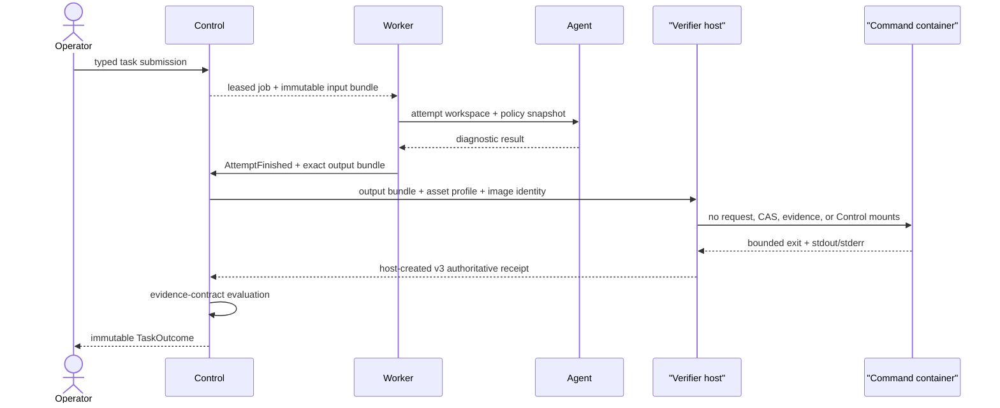
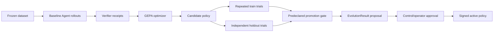

# Data Pipelines

This view records authority transitions. Detailed field-level behavior remains
in the [compatibility narrative](../architecture-and-data-pipeline.md).

## Direct Agent Run

```mermaid
sequenceDiagram
    actor Operator
    participant Agent
    participant Model
    participant Workspace
    participant Host as "Verifier host"
    participant Cmd as "Command container"
    Operator->>Agent: task + criteria + config/policy
    Agent->>Model: bounded prompt
    Model-->>Agent: strict decision
    Agent->>Workspace: allowlisted tool action
    Agent->>Host: exact workspace bundle + profile
    Host->>Cmd: direct PID 1; workspace RW; assets RO
    Cmd-->>Host: bounded exit + stdout/stderr
    Host-->>Agent: host-created request-bound receipt
    Agent-->>Operator: diagnostic AgentResult
```

This path produces a run result. It does not create an authoritative queued
`TaskOutcome` unless it enters the Control adjudication path.

## Queued Attempt And Adjudication



The Worker can complete execution but cannot declare task success. Control
rechecks the current attempt at publication time so stale or substituted output
cannot acquire authority.

## Contained Verification

The default host transport validates and materializes the exact workspace and
asset inputs, then starts one metadata probe and one direct command container per
`CommandSpec`. Candidate containers can change their disposable `/workspace` so
tests can run, but any lasting change makes the host-created command observation
fail. `/request.json`, `/bundles`, and `/artifacts` are absent. Candidate stdout
is stored as diagnostic evidence and is never decoded as a service result.

The host owns the global deadline, CID cleanup, output budget, before/after tree
measurements, receipt construction, binding validation, and publication. The
standalone Compose service remains a compatibility executor with a shared
service/command namespace and is not equivalent to this pipeline.

## Benchmark And Evolution



The current implementation has baseline/candidate evaluation and GEPA, but not
the complete Hermes lifecycle, repeated release-grade statistics, or one
manifest binding model, dataset, config, policy, image, source, and outputs.
Those gaps are `SH-EVOLVE-001`, `SH-BENCH-001`, and `SH-EVIDENCE-001`.

## Failure Semantics

| Boundary | Expected negative result | Infrastructure failure |
| --- | --- | --- |
| Agent | bounded unsuccessful `AgentResult` | provider/tool/transport exception |
| Worker | `AttemptFinished` can still describe an unsuccessful Agent run | no valid output lineage, queue `failed` |
| Verifier | receipt with failed exit, timeout, output, launch, or mutation observation | malformed request, Docker start failure, unavailable image, invalid source/artifact |
| Control | failed or indeterminate `TaskOutcome` | adjudication cannot publish and remains retryable |
| Evolve | candidate rejected by gate | incomplete trial or evidence contract failure |

Failure data must stay distinct from retryable transport failure. In particular,
queue `completed`, Agent `success`, verification `passed`, contract evaluation,
and task outcome are separate fields with separate authorities.
