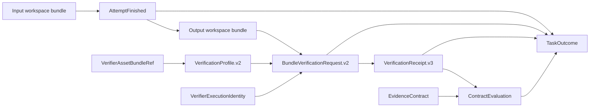

# Trust And Artifact Boundaries

## Trust Zones

| Zone | Trusted for | Not trusted for |
| --- | --- | --- |
| Operator and Control | task admission, final outcome, approval, active policy | candidate execution |
| Agent attempt workspace | proposed source changes | success claims, oracle or policy mutation |
| Host verifier transport | command observations and receipt creation | task lifecycle or policy activation |
| Evolve | candidate proposal and measured comparison | evidence creation, approval, activation |
| Model provider | bounded completion output | filesystem, queue, verification, or Control authority |

The current deployment is supervised and single-user. Logical trust zones often
share one local OS account, so they are ownership constraints enforced by code
and tests, not multi-tenant identity isolation.

## Artifact Ownership

| Artifact | Publisher | Immutable consumer binding |
| --- | --- | --- |
| `WorkspaceBundleRef` | workspace bundle store | archive SHA-256, size, tree hash, source commit |
| `AttemptFinished` | current fenced Worker attempt | job, attempt, input bundle, output bundle, result artifact |
| `VerifierAssetBundleRef` | operator asset CAS | manifest, regular-file tree, byte/entry counts |
| `VerifierExecutionIdentity` | host verifier transport | Docker reference and resolved immutable image ID |
| `VerificationProfile.v2` | operator/Control composition | command definitions and exact verifier asset reference |
| `BundleVerificationRequest.v2` | Agent adapter or Control | run, exact workspace, profile, execution identity |
| `VerificationReceipt.v3` | host verifier transport | request, bundle, profile, image, assets, commands, workspace states |
| `ContractEvaluation` | evidence adjudicator | contract and exact typed observations |
| `TaskOutcome` | Control | job, attempt, bundle, contract, profile, request, receipt, evaluation |
| `CandidatePolicy` | Evolve proposal | schema and candidate content hash |
| approval and active policy | Control/operator | candidate hash and local HMAC |

## Current Digest Chain

Control stores exact snapshots as well as digests where later reconstruction
would otherwise permit ambiguity. Queue completion is deliberately outside the
semantic success edge.

## Implemented Integrity Bindings

The current Control chain includes:

- a content-addressed regular-file verifier asset bundle;
- the resolved immutable verifier image identity and tag-drift check;
- profile, request, result, receipt, and outcome schema bindings;
- pre-publication host validation and tamper tests for every new identity;
- per-command containers with no request, bundle CAS, or evidence mount;
- host-only stdout/stderr, command-result, receipt, and service-result creation.

PR #11 at `5d872bc` closed `SH-VERIFY-001` and `SH-VERIFY-002` after all five
jobs in CI run `29848008998` passed. A read-only
asset mount proves integrity against writes but not secrecy from adversarial code
in the same mount namespace. Confidential hidden tests remain a separate
`SH-ORACLE-001` evaluator boundary.

## Storage Ownership

The Git common directory is the local authority root. SQLite authority state,
workspace bundles, verifier asset bundles, verification evidence, run artifacts, policy records, and
attempt workspaces are separate descendants with distinct publishers. Default
command containers receive only an exact materialized workspace and optional
read-only verifier assets. They do not receive a request file, bundle CAS,
artifact staging, authoritative evidence, queue database, or policy signing key.
The standalone Compose compatibility executor uses a different shared-service
topology and must be provisioned with fresh non-authoritative mounts.

Global quota, retention, deterministic garbage collection, external append-only
storage, and KMS identity remain open under `SH-ARTIFACT-001` and
`SH-TRUST-001`.
