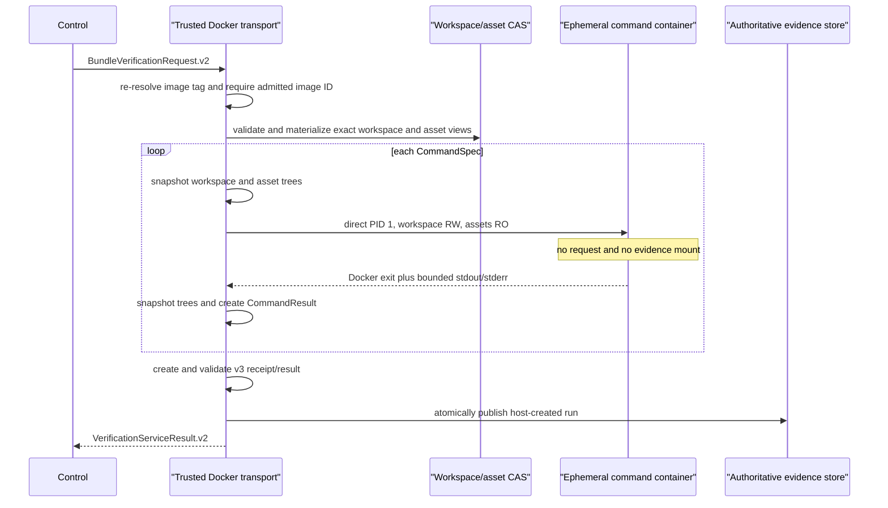

# Verifier Command Isolation Implementation Plan

- Date: 2026-07-22
- Status: In progress
- Owner boundary: Verifier host transport
- Related debt: `SH-VERIFY-002`, `SH-ARCH-002`, `SH-IO-001`, `SH-TEST-001`
- Predecessor: Slice C verifier asset and image integrity binding

## 1. Verified Problem

The current Docker path runs `BundleVerifierService` and each configured test
command under one container UID and mount namespace. The container receives a
fresh writable evidence staging mount. Process-group cleanup catches ordinary
children and detached children that keep output pipes open, but a candidate can
create a new session, close inherited pipes, and remain alive until PID 1 exits.

Consequently, the current boundary does not prove that candidate code cannot
read, delete, or race files in writable staging. Digest validation on the host
detects inconsistent output, but an unkeyed digest is not an authority boundary
against a process that can reach both the staged bytes and the service stdout.
This is distinct from hidden-oracle confidentiality: it concerns ownership of
the verification receipt itself.

## 2. Required Invariant

For the default contained path:

1. candidate commands never receive the request file, bundle CAS, authoritative
   evidence root, or a writable evidence staging mount;
2. each command is the direct container PID 1, so its container lifetime ends
   with the command and detached descendants cannot outlive it;
3. only the trusted host transport writes stdout/stderr artifacts, command
   results, the v3 receipt, the service result, and the service-request record;
4. the host measures workspace and verifier-asset trees before and after every
   command and constructs pass/failure semantics from Docker exit, timeout,
   output-limit, and mutation facts;
5. request/profile/workspace/image/asset/command bindings remain byte-compatible
   with the current v2/v3 contracts;
6. the legacy in-container executor remains import-compatible but is not used by
   default Agent or Control composition and carries no stronger security claim.

## 3. Target Execution Flow

## 4. Implementation Sequence

### Phase A: Host-owned command execution

1. Replace the service-container command builder in
   `adapters/docker_verifier.py` with a per-command builder that:
   - executes the admitted immutable image ID;
   - overrides the image entrypoint with `CommandSpec.argv[0]`;
   - uses `/workspace` as the working directory;
   - mounts only the materialized workspace read-write and the exact verifier
     asset tree read-only;
   - retains non-root, no-network, read-only root, dropped capabilities,
     no-new-privileges, PID, CPU, memory, and tmpfs limits;
   - creates a distinct CID file for every command.
2. Materialize the exact workspace bundle with
   `FilesystemWorkspaceBundleStore` into a private host temporary directory.
3. Keep image admission and tag-drift checks before any command starts.

### Phase B: Host-owned evidence construction

1. Add a bounded Docker command outcome that distinguishes normal exit, launch
   failure, timeout, and combined-output overflow while retaining captured byte
   prefixes.
2. Write stdout and stderr only after the command container has terminated.
3. Construct `CommandResult` from host-observed facts and preserve the existing
   failure categories and workspace-mutation rule.
4. Construct `VerificationReceipt.v3` and `VerificationServiceResult.v2` on the
   host. Run `validate_final_verification_bindings` before publication.
5. Re-read the staged and published receipt through
   `FilesystemVerificationEvidenceStore` before returning.

### Phase C: Provenance and exact views

1. Resolve and hash `argv[0]` in a metadata-only invocation of the exact image.
   The probe uses isolated Python startup, a read-only workspace mount, no
   request, no assets, and no evidence mount. Probe failure records unavailable
   executable provenance; it cannot grant a pass.
2. Validate the verifier asset tree before and after every command even though
   its mount is read-only.
3. Reject workspace or asset path replacement, symlink substitution, image-tag
   movement, malformed CIDs, and publication collisions before authority moves.

### Phase D: Compatibility and documentation

1. Retain `BundleVerifierService` and `VerificationExecutorPort` for legacy wire
   decoding and explicit compatibility tests.
2. Keep profile/request/result/receipt/outcome schema versions unchanged; the
   security change is an execution topology change, not a wire migration.
3. Mark the Compose service as compatibility-only until Compose drives the same
   host-owned loop. It must not be cited as proof of candidate/evidence
   isolation.
4. Update the architecture map, ADR, security policy, current review, conformance
   crosswalk, and implementation debt register with exact current facts.

## 5. Regression Strategy

### Unit and contract tests

- command construction contains `/workspace` and optional `/verifier-assets`,
  but no `/request.json`, `/bundles`, or `/artifacts` mount;
- every command uses the admitted immutable image ID and direct entrypoint;
- host-created receipt preserves request, bundle, profile, image, asset, command,
  and workspace-state bindings;
- normal failure remains a valid failed receipt, while Docker infrastructure
  failure remains a transport error;
- timeout, output overflow, mutation, missing executable, and malformed output
  are fail-closed and bounded;
- staged and published artifact substitution is rejected;
- v1 decoding and explicit in-process compatibility behavior remain unchanged.

### Real Docker adversarial tests

- a command confirms that `/request.json`, `/bundles`, and `/artifacts` are absent;
- a command attempts to create a detached session and returns; the run completes
  without a surviving process or writable evidence path;
- a command mutates the workspace and receives a failed receipt;
- asset mutation fails at the read-only mount and asset tree identity remains
  unchanged;
- non-root, no-network, read-only root, dropped capabilities, and resource
  limits remain observable;
- the full Control path publishes a v2 `TaskOutcome` from the host-created v3
  receipt.

## 6. Acceptance Gates

The work is complete only when all gates pass on one revision:

1. focused Docker transport, evidence, Control, compatibility, and architecture
   suites pass;
2. the real Docker adversarial suite passes against an image rebuilt from that
   revision;
3. the complete Python suite passes with branch coverage at or above 90.0%;
4. Ruff, Bandit with medium/high threshold, compileall, lock validation, Compose
   parsing, documentation links, and `git diff --check` pass;
5. source and wheel build offline, the wheel installs with `--no-index --no-deps`,
   and the installed CLI starts outside the source tree;
6. PR CI targets the final head SHA and all required jobs pass before merge;
7. the merge revision is pulled into local `main` and the debt closure record is
   committed against that revision.

## 7. Rollback and Migration

The wire format does not change, so rollback is limited to the Docker transport
implementation. A failure before publication leaves only a temporary workspace
and host staging directory, both removed on context exit. No partial result is
returned. Existing authoritative runs are immutable and remain readable.

The legacy in-container service is not deleted in this slice. That avoids import
and standalone-tool churn while the default composition moves to the stronger
boundary. A later compatibility-removal decision belongs to `SH-COMPAT-001`.

## 8. Non-goals

- secret-oracle confidentiality, which remains `SH-ORACLE-001`;
- multi-tenant identity, KMS signing, or an external append-only ledger;
- release image attestation and SBOM publication;
- benchmark/evolution migration to the contained runtime;
- full Agent/Evolve/Control transport and Compose parity.

## 9. Local Implementation Checkpoint

The implementation and local proof are complete on the working branch:

- every default command is direct container PID 1 and has no request, bundle
  CAS, or evidence mount;
- the host constructs bounded command artifacts, v3 receipts, and v2 service
  results, then validates staged and published evidence;
- timeout and output-limit paths preserve bounded diagnostic prefixes and remove
  the recorded container;
- 440 Python tests pass with three Docker-opt-in tests skipped and 90.2% branch
  coverage;
- all three opt-in real Docker tests pass against the locally rebuilt image.

Static analysis, documentation, source/wheel offline build, isolated wheel
installation, and CLI startup gates also pass locally. PR CI, merge, refreshed
local `main`, and the post-merge debt closure record are still required before
this plan can be marked complete.
