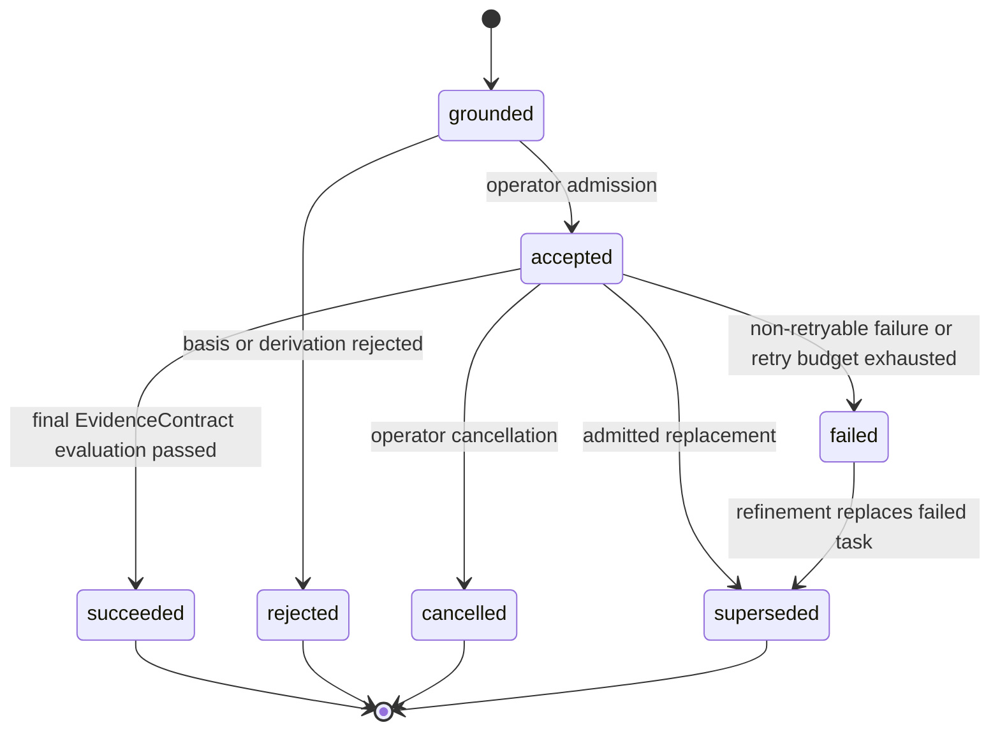
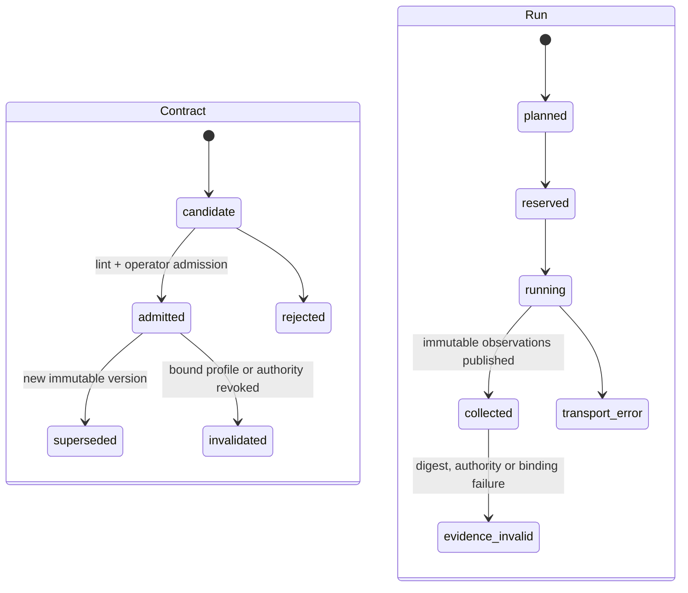
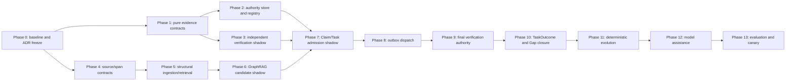

# Evidence-Contract Grounded Task/Knowledge Graph Architecture and Evolution Plan

- 상태: 단계 구현 중(Phase 1 핵심 vertical slice 및 독립 판정/derived GraphRAG foundation 완료; 전체 Phase 1과 권위 graph는 미완료)
- 기준일: 2026-07-21
- 기준 코드: `codex/harden-service-boundaries` / `cf7fcf0` 위의 현재 working tree
- 범위: structural source ingestion, chunk provenance, derived knowledge graph,
  evidence contract, claim/gap resolution, task derivation, task graph,
  evidence-driven evolution

## 0. 2026-07-21 구현 체크포인트

이 문서는 전체 목표 아키텍처를 유지한다. 현재 구현은 아래의 첫 vertical slice이며,
나머지 phase를 완료한 것으로 간주하지 않는다.

| 영역 | 현재 구현 | 검증된 경계 | 아직 남은 권위 계층 |
| --- | --- | --- | --- |
| Evidence contract | strict immutable `EvidenceContract`, 별도 `GapClosureRule`, 제한된 predicate AST, 3값 pure evaluator, profile/adapter digest binding | Agent 성공 Boolean과 contract 결과가 서로 독립이며 누락·중복·오류 evidence, scalar/collection subclass와 비교 type mismatch는 fail-closed | template/registry, admitted contract store, TaskOutcome/Gap transition transaction |
| Final verification | exact `CodingJobResult.output_bundle` → `VerificationServicePort` → typed command observations → Control evaluation | request/bundle/profile/run/commit/tree/artifact/command/observation 결박, workspace state chain, receipt 사실 재계산 | verifier-only hidden asset bundle, structured JUnit/SARIF artifact adapter, durable run/evaluation audit store |
| Derived GraphRAG | immutable SQLite node/edge/term index, provenance/content/metadata/revision digest, candidate/dependency별 depth ≤3 traversal | body → entity → task의 seeded depth-3 경로, atomic dependency cycle 거부, snapshot revision, strict score/path/eligibility projection 검증 | typed SourceDocument/StructuralChunk/EvidenceSpan 및 exact span admission, retrieval coverage manifest, Claim/TaskBasis authority store |
| Interface | `graph-init`, `graph-put-node`, `graph-put-edge`, `graph-search`, `graph-dependencies`, `graph-next` JSON CLI | 색인 revision과 모든 query 결과에 `derived_candidate_only` authority 표시 | source/evidence/contract explain 및 admission commands |

따라서 현재 GraphRAG 결과는 검색·분류·다음 태스크 후보를 위한 데이터일 뿐이다.
본문 offset과 chunk metadata도 아직 admitted `EvidenceSpan`이 아니며, graph 결과가 직접
Claim, Gap 또는 Task 상태를 바꾸지 않는다.

`graph-next`의 `candidate_max_depth`와 `dependency_max_depth`는 서로 다른 traversal
budget이다. 두 값을 결과 contract에 함께 기록하고 각 dependency inspection을 동일한
index revision에 결박한다. 따라서 작은 anchor 후보 반경이 숨은 depth-3 dependency
탐색으로 확장되는 것처럼 표현하지 않으며, 호출자가 두 budget을 독립적으로 제한한다.

현재 vertical slice의 완료 증거는 다음과 같다.

- [x] contract가 verification profile과 observation adapter digest를 선행 고정한다.
- [x] Control은 Agent의 성공 주장 대신 exact output bundle의 독립 verifier receipt만
  authoritative artifact에서 다시 읽어 typed fact로 정규화하고 판정한다.
- [x] evaluator와 wire contract는 mutable/stateful tuple 입력을 거부한다.
- [x] SQLite dependency cycle 검사와 insert가 하나의 `BEGIN IMMEDIATE` transaction이다.
- [x] query는 시작/종료 revision을 비교하며 revision 자체는 하나의 read snapshot에서
  metadata, node/edge payload, term projection, endpoint, dependency DAG를 검증한다.
- [x] GraphRAG projection은 경로, 점수, 순위, eligibility, unmet reason, authority,
  revision/depth budget의 상호 일치를 생성 시 검증한다.
- [x] graph write는 같은 `BEGIN IMMEDIATE` transaction에서 전체 integrity를 먼저
  검증한다. canonical node/edge/term projection을 쓴 뒤 postflight도 수행하므로
  trigger가 write 중 projection을 손상해도 어떤 node/edge도 commit하지 않는다.
- [x] Docker verifier는 기존 evidence root나 전체 bundle CAS를 mount하지 않는다.
  exact request bundle의 검증된 archive/reference만 새 read-only view로 복사하고,
  실행별 빈 staging에서 산출한 receipt를 host가 size/SHA/schema/content 검증한 뒤
  원자 게시한다. Docker stdout/stderr 합계도 bounded capture한다.
- [x] same-process-group verifier descendant와 열린 output pipe는 bounded cleanup 후
  `process_leak`으로 fail closed한다. 완전 분리된 descendant에는 Docker가 필요하다.
- [x] model tool은 root/nested `.gitignore`를 변경해 ignored side effect를 숨길 수 없고,
  tracked 파일이 아닌 ignored path write/delete도 거부한다.
- [ ] documentary evidence의 exact `EvidenceSpan`, body coverage receipt, Claim/TaskBasis
  admission 및 authoritative task/Gap transition은 후속 phase다.

## 1. 전환 목표 아키텍처 레이어

```mermaid
flowchart TB
    subgraph L1["1. Interface / Projection"]
        CLI["CLI source-*, evidence-*, graph-* commands"]
        View["JSON / Mermaid provenance, knowledge and task views"]
        Import["Optional .planning import/export adapter"]
    end

    subgraph L2["2. Control Application / Authority"]
        SourceApp["SourceIngestionService"]
        CandidateAdmission["Claim-candidate admission"]
        GroundingSvc["Claim / gap resolution"]
        ContractSvc["Evidence-contract registry and compiler"]
        TaskAdmission["Task-basis admission"]
        Scheduler["Readiness scheduler"]
        Reconciler["Evidence reconciliation and closure"]
        DerivationSvc["Task derivation service"]
    end

    subgraph L3["3. Authoritative Grounding / Verification / Task Domain"]
        Grounding["Goal / Requirement + admitted Claim -> Gap -> TaskBasis"]
        Contract["EvidenceContract -> VerificationPlan -> Predicate/Contract Evaluation"]
        Aggregate["Grounded TaskGraph aggregate"]
        Invariants["Authority / provenance / lifecycle invariants"]
        Readiness["Blocked / ready projection"]
        Ordering["Ordering of grounded ready tasks"]
    end

    subgraph L4["4. Derived Knowledge / Retrieval Domain"]
        Documents["SourceDocument -> StructuralChunk -> EvidenceSpan"]
        Knowledge["Mention -> CanonicalEntity -> TypedRelation"]
        Candidates["ClaimCandidate + extraction provenance"]
        Retrieval["Hybrid retrieval and structural coverage"]
    end

    subgraph L5["5. Contracts / Ports"]
        SourceContracts["Source / Chunk / Span / Extraction contracts"]
        GroundingContracts["Evidence / Claim / Gap / TaskBasis contracts"]
        ContractContracts["EvidenceContract / Observation / Evaluation contracts"]
        GraphContracts["Versioned task-graph contracts"]
        SourcePorts["SourceReader / Parser / Chunker / KnowledgeIndex ports"]
        GraphPorts["GroundingStore / TaskGraphStore / Derivation ports"]
        ExecutionPorts["Dispatch / Verification / EvidenceReader ports"]
    end

    subgraph L6["6. Adapters / Infrastructure"]
        KnowledgeDB["knowledge-index.sqlite3; rebuildable derived projection"]
        GraphDB["task-graph.sqlite3; admitted authority + audit events"]
        Artifacts["Immutable source, receipt and workspace artifacts"]
        Outbox["Transactional dispatch outbox"]
        Extractor["Bounded parser / entity-relation extraction adapters"]
        Generator["Bounded claim / task candidate adapters"]
        QueueAdapter["Existing JobQueue adapter"]
    end

    subgraph L7["7. Execution Authorities"]
        Control["Control owns admission, contracts, graph, queue and closure"]
        Worker["Worker owns one leased attempt"]
        Agent["Any coding agent implements one immutable TaskSpec"]
        Verifier["Verifier executes approved profiles and emits observations"]
        Evaluator["Control evaluates immutable predicates"]
        PolicyEvolve["Existing Evolve changes strategy/cadence only"]
    end

    CLI --> SourceApp
    CLI --> GroundingSvc
    CLI --> ContractSvc
    CLI --> TaskAdmission
    View --> SourceApp
    View --> GroundingSvc
    Import --> TaskAdmission
    SourceApp --> Documents
    Documents --> Knowledge
    Knowledge --> Candidates
    Retrieval --> Candidates
    Documents --> SourceContracts
    Knowledge --> SourceContracts
    CandidateAdmission --> Grounding
    GroundingSvc --> Grounding
    ContractSvc --> Contract
    TaskAdmission --> Aggregate
    Scheduler --> Readiness
    Scheduler --> Ordering
    Reconciler --> Contract
    Reconciler --> Invariants
    DerivationSvc --> Grounding
    Grounding --> Invariants
    Grounding --> GroundingContracts
    Contract --> Invariants
    Contract --> ContractContracts
    Aggregate --> Invariants
    Aggregate --> GraphContracts
    SourceApp --> SourcePorts
    CandidateAdmission --> GroundingContracts
    ContractSvc --> ContractContracts
    TaskAdmission --> GraphContracts
    CandidateAdmission --> GraphPorts
    GroundingSvc --> GraphPorts
    ContractSvc --> GraphPorts
    TaskAdmission --> GraphPorts
    Scheduler --> GraphPorts
    Scheduler --> ExecutionPorts
    Reconciler --> GraphPorts
    DerivationSvc --> GraphPorts
    SourcePorts --> Extractor
    SourcePorts --> KnowledgeDB
    GraphPorts --> GraphDB
    GraphPorts --> Generator
    ExecutionPorts --> Outbox
    Outbox --> QueueAdapter
    Extractor --> Artifacts
    Generator --> Artifacts
    QueueAdapter --> Worker
    Worker --> Agent
    Agent --> Verifier
    Verifier --> Artifacts
    Reconciler --> ExecutionPorts
    Evaluator --> Contract
    Control -. hosts and owns .-> SourceApp
    Control -. hosts and owns .-> GroundingSvc
    Control -. hosts and owns .-> ContractSvc
    Control -. hosts and owns .-> TaskAdmission
    PolicyEvolve -. no evidence, contract or graph authority .-> Control
```



### 1.1 레이어 규칙

1. Task의 1차 질문은 "무엇을 실행할까"가 아니라 "어떤 미해결 Gap이 이 Task를
   정당화하며, 어떤 관찰이 완료를 증명하는가"다.
2. 원문 근거는 `SourceDocument -> StructuralChunk -> EvidenceSpan`으로 먼저 고정한다.
   초록, 본문, 표, 부록의 위치를 잃은 문서 단위 reference는 semantic Claim의 충분한
   근거가 아니다.
3. entity/relation/Claim 추출 결과는 확률적인 knowledge candidate다. exact span과
   extraction provenance가 있더라도 Control admission 전에는 권위 Claim이나 TaskBasis가
   될 수 없다.
4. rebuildable knowledge graph와 admitted grounding/task graph를 분리한다. knowledge
   index 손실이나 재추출이 이미 승인된 EvidenceSpan/Claim/TaskBasis의 의미를 조용히
   바꾸어서는 안 된다.
5. `Goal/Requirement + admitted Evidence/Claim -> Gap -> TaskBasis -> TaskNode`의 추적
   연결이 없는 항목은 실행 가능한 task가 아니라 derivation candidate다.
6. 모든 executable TaskNode는 admission 전에 immutable `EvidenceContract`를 가진다.
   task-success 계약과 Requirement-owned `GapClosureRule`은 서로 다른 권위 객체다.
7. EvidenceContract는 승인된 observation type과 제한된 predicate DSL만 사용한다.
   모델이나 Agent가 임의 shell, verifier profile 또는 합격 조건을 활성화할 수 없다.
8. `TaskNode`, queue의 `JobRecord`, Agent 내부의 step, `VerificationRun`,
   `GapClosureEvaluation`은 서로 다른 수명주기다.
9. Control만 candidate admission, claim/gap 상태, evidence contract, task basis, graph
   node/edge, dispatch binding, predicate evaluation과 terminal 상태를 변경한다.
10. Planner/model은 span/evidence reference에 결박된 strict candidate만 반환한다.
    evidence를 발명하거나 knowledge/graph DB, queue, verifier, workspace tool에 직접
    접근하지 않는다.
11. Goal contribution은 soft score가 아니라 traceability hard gate다. 정보 획득
    task는 해소할 uncertainty와 산출할 evidence를 명시해야 한다.
12. 동일 Gap에 대해 materially equivalent action과 EvidenceContract를 가진 task는
    점수 감점이 아니라 admission 단계에서 duplicate로 거부한다.
13. Scheduler는 grounding과 evidence-contract gate를 통과하고 deterministic validator가
    `ready`로 계산한 node만 기존 queue에 전달한다.
14. 비용, 위험, 차단 해소도 같은 ordering score는 근거가 유효한 ready task 사이의
    실행 순서에만 사용한다.
15. queue의 `completed`, `AgentResult.success`, test command의 exit code 중 어느 것도
    단독으로 완료를 뜻하지 않는다. digest 검증된 observations에 대한 immutable
    predicate evaluation만 task를 `succeeded`로 만들 수 있다.
16. Agent는 전체 graph나 closure authority가 아니라 승인된 단일 TaskSpec,
    EvidenceContract의 공개 부분, 허용된 도구만 받는다. hidden/Control-owned oracle은
    Agent가 수정할 수 없다.
17. 기존 `evolution.py`는 strategy/cadence policy evolution으로 유지한다. ingestion,
    contract synthesis, task grounding/derivation은 별도 계약과 모듈을 사용한다.
18. Mermaid와 JSON은 각 권위/파생 DB에서 만든 projection이다. 시각화 파일 자체를
    source of truth로 사용하지 않는다.
19. `.planning/`은 로컬 Taskflow 상태다. core runtime이 직접 읽지 않고 선택적
    import/export adapter로만 연결한다.

## 2. 목표 피드백 루프

```mermaid
sequenceDiagram
    participant O as Operator
    participant I as Source Ingestion
    participant K as Derived Knowledge Index
    participant C as Control / Grounding Authority
    participant G as Task Graph Store
    participant E as Evidence Contract Engine
    participant D as Outbox Dispatcher
    participant Q as JobQueue
    participant W as Worker / Agent
    participant V as Independent Verifier
    participant P as Task Derivation Service

    O->>I: register immutable source and authority metadata
    I->>K: parse structure, chunk, span, mention, entity and relation candidates
    K-->>C: ClaimCandidate + exact spans + extraction provenance
    C->>C: validate source digest, coverage and ontology; admit or reject Claim
    C->>G: persist admitted evidence reference, Claim and Gap
    G-->>P: unresolved Gap + bounded evidence + prior attempts
    P-->>C: TaskBasis + EvidenceContract candidates
    C->>E: compile approved templates and validate predicates
    E-->>C: immutable contract digest or specification Gap
    C-->>O: grounded TaskBasis and EvidenceContract for admission
    O->>C: admit, reject or request stronger oracle
    C->>G: persist basis, contract, node, edges and audit event
    C->>G: load graph revision N
    C->>C: revalidate basis, contract, readiness and ordering
    C->>G: reserve node and append dispatch intent
    G-->>D: pending dispatch intent
    D->>Q: idempotent enqueue(snapshot and contract-bound payload)
    Q->>W: lease one job attempt
    W->>W: implement; may propose non-authoritative evidence
    W-->>Q: CodingJobResult + exact output bundle
    Q-->>C: terminal execution result
    C->>C: validate dispatch, attempt and output bundle correlation
    C->>V: execute approved baseline/candidate profiles on exact bundles
    V-->>C: digest-bound observations and receipts
    C->>E: normalize observations and evaluate immutable predicates
    E-->>C: TaskOutcome + clause-level explanation
    C->>G: persist observations, evaluation and task transition
    C->>E: evaluate separate Requirement closure rule
    E-->>C: GapClosureEvaluation
    C->>G: close, narrow or reopen Gap; invalidate affected bases
```

루프는 두 개이며 권위가 다르다.

1. **지식 루프:** immutable source -> structural chunk -> span-bound candidate ->
   operator/deterministic admission -> Claim. 이 루프의 extraction과 retrieval 결과는
   재생성 가능하고, admission 전에는 사실 권위가 없다.
2. **실행 루프:** Requirement/Claim -> Gap -> TaskBasis + EvidenceContract -> Task ->
   observations -> predicate evaluation -> TaskOutcome -> 별도 Gap closure evaluation.

새 task는 빈 prompt에서 생성하지 않는다. unresolved Gap을 닫을 action뿐 아니라
완료를 판별할 계약을 먼저 만들 수 있을 때만 task node를 materialize한다. 조건식을
만들 수 없으면 코딩 task를 강행하지 않고 `specification_oracle_missing` Gap과 조사·명세
task를 생성한다. 실행 후에는 새 Evidence가 기존 Claim과 Gap을 갱신한다. Gap이
닫히면 후속 task를 만들지 않고, 일부만 남으면 residual Gap만 refinement한다. 실패한
workspace output과 Agent가 제시한 결과는 진단 evidence candidate일 뿐이며 자동으로
다음 task의 실행 기준점이나 성공 권위가 되지 않는다.

## 3. 현재 코드베이스 기준선

아래 표는 계획 수립 때 확인한 legacy 기준선과 현재 working tree에 구현된 핵심
vertical slice를 함께 구분한다. `현재 구현`은 이 문서 상단 체크포인트 및 실제 module과
동일해야 하며, `graph 도입 시 의미`는 아직 남은 authoritative graph 전환을 뜻한다.

| 현재 구현 | 코드 근거 | graph 도입 시 의미 |
| --- | --- | --- |
| Agent task는 instruction과 unique criteria만 보유 | `contracts/agent.py::AgentTask` | durable ID, dependency, lifecycle은 별도 graph domain에 둔다. |
| acceptance criteria와 verifier criterion은 stable ID가 아닌 자유 문자열 | `contracts/agent.py::AgentTask`, `contracts/verification.py::CommandSpec`, `agent.py::_require_criterion_coverage` | 문자열 일치 검사를 유지 호환층으로 한정하고 EvidenceContract clause ID로 전환한다. |
| 한 command의 pass/fail이 연결된 모든 criterion에 그대로 투영됨 | `contracts/verification.py::_criteria_payload`, `benchmarks.py::_criterion_pass_rate` | command 실행 결과를 사실 observation으로만 보고 criterion별 predicate evaluation을 별도 도메인에 둔다. |
| durable 실행 상태는 flat `jobs`의 `queued/running/completed/failed`뿐 | `models.py::JobStatus`, `database.py`, `queue.py` | task 의미 상태를 `jobs`에 추가하지 않는다. |
| claim은 dependency 없이 FIFO/reclaim 대상 한 건을 선택 | `queue.py::JobQueue.claim` | readiness는 queue 앞의 Control scheduler가 계산한다. |
| queued worker는 source bundle을 isolated attempt workspace로 materialize하고 output bundle을 생성 | `worker.py::CodingWorker._execute_attempt` | graph execution은 immutable input/output bundle lineage를 재사용한다. |
| queued payload는 현재 config digest, policy snapshot, workspace bundle을 함께 저장 | `cli.py::_main`, `worker.py::CodingJobPayload` | graph-managed dispatch에서는 이 snapshot 세트를 필수로 한다. |
| result는 job/attempt와 source/output bundle, AgentResult를 결합 | `contracts/control.py::CodingJobResult` | graph/node/spec/dispatch correlation을 별도 binding 또는 v2 contract로 추가한다. |
| `CodingJobResult.success == AgentResult.success`이고 Worker가 이를 queue terminal에 사용 | `contracts/control.py::CodingJobResult.__post_init__`, `worker.py::CodingWorker` | 이 Boolean은 execution terminal 호환값으로 유지하고 TaskOutcome authority로 재사용하지 않는다. Reconciler는 completed/failed 양쪽을 읽는다. |
| AgentResult v2는 verification artifact reference를 보유 | `contracts/agent.py::AgentResult` | Reconciler가 final evidence를 직접 검증할 수 있다. |
| benchmark는 receipt artifact를 digest 검증해 점수화 | `benchmarks.py`, `infra/verification_evidence.py` | artifact integrity/receipt reader는 재사용하되 task 완료는 별도 contract evaluator가 판정한다. |
| bundle-bound Verifier service와 profile digest가 구현됨 | `contracts/verification_service.py`, `services/verifier.py` | profile 실행은 재사용하되 Control-owned contract digest, stage와 observation schema를 request/result v2로 확장한다. |
| strict EvidenceContract, GapClosureRule, typed observation, tri-state evaluator와 독립 Control adjudication vertical slice가 구현됨 | `contracts/evidence_contract.py`, `evidence_contract.py`, `adapters/receipt_observations.py`, `services/evidence_contract.py` | task 성공 판정 primitive는 재사용하되 admitted registry와 TaskOutcome/Gap transition 권위는 별도로 추가한다. |
| candidate-only persistent GraphRAG와 dependency/next-step projection이 구현됨 | `contracts/knowledge.py`, `knowledge_graph.py`, `infra/knowledge_index.py`, `ports/knowledge.py` | 검색 결과를 곧바로 TaskBasis/Task로 승격하지 않고 source evidence 및 grounding admission layer를 먼저 추가한다. |
| typed 문서 parser/structural ingestion과 entity/relation extractor는 없고, 수동 입력 node의 lexical+graph retrieval만 있음 | `knowledge_graph.py`, `infra/knowledge_index.py`; `SourceDocument`/`StructuralChunk`/`EvidenceSpan` contract와 ingestion port 부재 | 현 retrieval foundation 앞에 deterministic structural parser와 evidence admission을 추가한다. |
| 기존 evolution은 strategy/cadence만 변경 | `evolution.py::EvolutionRunner`, `contracts/policy.py` | task grounding/derivation policy와 타입을 재사용하거나 혼합하지 않는다. |
| exact output bundle을 검증·판정하는 독립 Control service는 있으나 Goal/Gap/Task authority service는 없음 | `services/evidence_contract.py`, `services/verifier.py`; admitted grounding store 부재 | 구현된 adjudication service를 TaskOutcome/Gap reconciliation과 직접 합치지 않고 application boundary 뒤에서 조합한다. |
| `.planning/task.json`에 `subtasks[].depends_on`이 있으나 `src/`는 이를 읽지 않음 | untracked `.planning/` local state | runtime schema로 복사하지 않고 adapter 대상으로만 본다. |

계획 수립 당시 `docs/architecture-and-data-pipeline.md`에서 확인한 다음 drift는 이
branch의 Phase 0 문서 정합화에서 수정했다.

- queue submit 시 config/policy/workspace snapshot이 없다는 설명
- worker가 원본 repository를 직접 변경한다는 설명
- benchmark가 Agent step projection을 점수 권위로 사용한다는 설명
- workspace bundle이 runtime에 연결되지 않았다는 설명

Phase 0에서 나머지 architecture 문서도 current, transitional, target 상태로 다시
구분해야 한다. 현재 working tree에는 immutable bundle, strict wire parsing,
receipt/request/profile/contract/adapter digest, typed observation, stable clause ID,
tri-state task evaluator와 separate Requirement closure evaluator primitive가 있다.
핵심 결손은 semantic source/span provenance와 coverage, admitted Claim/Gap/TaskBasis,
operator-owned registry, baseline/candidate oracle asset, authoritative TaskOutcome/Gap
transaction이다.

## 4. 설계 범위

### 4.1 목표

- source digest와 문서 구조를 보존한 chunk/span provenance를 만들고, 초록 편향이나
  검색 누락을 `unknown`으로 드러낸다.
- entity/relation/Claim 추출을 rebuildable candidate graph에 한정하고, 승인된 근거
  graph와 권위를 분리한다.
- 목표, requirement, claim, evidence, gap, task basis, 실행, closure evidence의
  연결을 영속화한다.
- 모든 executable task에 stable clause ID, typed observation과 제한된 predicate로 된
  immutable EvidenceContract를 먼저 확정한다.
- 어떤 coding agent를 사용하더라도 같은 input/output bundle과 contract에 대해 같은
  독립 판정 결과를 내는 agent-neutral completion protocol을 제공한다.
- 모든 task가 어떤 미해결 Gap 때문에 존재하며 어떤 evidence로 종료되는지
  역추적할 수 있게 한다.
- 실행 결과로 Claim과 Gap을 갱신하고 residual Gap이 있을 때만 후속 task를
  도출한다.
- 현재 graph revision에서 근거가 유효한 실행 가능 frontier와 선택 이유를
  결정적으로 계산한다.
- derivation, grounding/admission, 실행 권한을 분리하고 모든 전이를 감사 가능하게
  남긴다.
- 기존 direct/queued 실행 경로를 유지하면서 opt-in으로 단계 배포한다.

### 4.2 첫 릴리스 범위

- Markdown/일반 text와 repository source의 deterministic structural ingestion,
  exact EvidenceSpan, section/body coverage projection
- optional entity/relation/ClaimCandidate extraction과 manual candidate admission;
  vector DB나 완전 자동 wiki 생성은 포함하지 않음
- operator가 등록한 Goal/Requirement와 evidence-backed Claim/Gap graph
- approved template에서 만든 `EvidenceContract.v1`과 `GapClosureRule.v1`, pure
  tri-state predicate engine, clause-level explanation
- 기존 `VerificationProfile`/`VerificationReceipt`를 typed observation으로 변환하는
  compatibility adapter와 candidate bundle 독립 재검증
- bug-fix, feature, refactor, compatibility 네 종류의 contract template
- 검증된 `TaskBasis`에서만 materialize되는 task graph
- `requires`, `refines`, `supersedes` 관계
- JSON/Mermaid grounding projection과 `explain-basis`, `explain-next`
- deterministic grounding gate, readiness, ordering
- outbox 기반 queue dispatch와 evidence-bound reconciliation
- residual/contradicted Gap에서 만드는 수동 승인 refinement derivation

### 4.3 비목표

- 첫 릴리스에서 모든 문서 형식/OCR/웹 크롤링/범용 vector DB를 지원하지 않는다.
- GraphRAG entity/relation edge를 사실, 분류 정답 또는 task authority로 취급하지
  않는다.
- abstract-only evidence로 일반 Requirement를 close하지 않는다. Requirement가
  명시적으로 초록 자체를 대상으로 할 때만 예외로 한다.
- Agent step을 graph node로 바꾸지 않는다.
- 기존 `jobs` 테이블을 task graph로 확장하지 않는다.
- score가 높다는 이유만으로 Goal/Gap 연결이 없는 task를 만들지 않는다.
- model confidence를 evidence truth나 grounding validity로 취급하지 않는다.
- 첫 릴리스에서 여러 workspace output을 자동 merge하지 않는다.
- 모델이 verifier command, acceptance authority, queue job을 직접 만들지 못한다.
- Agent가 추가한 테스트나 자기 final receipt만으로 completion을 확정하지 않는다.
- EvidenceContract DSL에서 임의 Python, shell, SQL, regex backtracking 또는 plugin
  callback을 실행하지 않는다.
- 기존 GEPA policy evolution을 task evolution으로 이름만 바꾸지 않는다.
- graph event log만으로 즉시 완전한 event sourcing/replay를 보장한다고 주장하지
  않는다.
- 기존 `agent-run`, `task-submit`, low-level queue CLI를 즉시 제거하지 않는다.

## 5. Grounding과 Task Domain 모델

### 5.1 엔티티

| 엔티티 | 필수 정보 | 권위/불변성 |
| --- | --- | --- |
| `SourceDocumentVersion` | source ID/version, immutable artifact ref/digest, URI/path, media type, title, language, document type, authority/access class, fetched/observed time, parser eligibility | source bytes의 identity. 같은 source의 새 bytes는 새 version이며 기존 evidence를 덮어쓰지 않음. |
| `DocumentSection` | document version, stable structural path, heading, section kind, page/offset bounds, ordinal, parent ID | parser가 만든 구조 projection. `abstract`, `body`, `table`, `appendix`, `bibliography`, `code`를 최소 구분. |
| `StructuralChunk` | section ID/path, page, char/token offsets, ordinal, parent/previous/next chunk IDs, content digest, parser/chunker ID+version | retrieval 단위. 원문을 복제하지 않고 source artifact의 정확한 범위를 가리키며 경계를 재현 가능해야 함. |
| `EvidenceSpan` | chunk/source digests, exact char offsets, quoted-text digest, locator, scope, authority, admitted status | semantic 근거의 최소 인용 단위. source bytes와 대조되는 exact span 없이는 admitted Claim을 support하지 못함. |
| `OntologyVersion` | ontology ID/version/digest, entity/relation/category definitions, compatibility policy | taxonomy 변경은 새 version. 기존 candidate/admission을 silent reclassify하지 않음. |
| `ExtractionRun` | source/chunk set digests, parser/extractor/model/prompt versions, ontology digest, limits, time, result artifact | 추출 재현성과 비용 provenance. 성공 여부는 추출 결과의 진실성을 뜻하지 않음. |
| `Mention` / `CanonicalEntity` | span, surface form, normalized identity, aliases, type candidates, resolution status, ontology version | mention은 span-bound 사실, canonicalization은 파생 해석. unresolved/ambiguous를 허용하고 강제 병합하지 않음. |
| `TypedRelationCandidate` | subject/object entity candidates, relation type, temporal scope, supporting/contradicting spans, extraction run, confidence | rebuildable knowledge edge. admission 전에는 권위 graph edge가 아님. |
| `ClaimCandidate` | normalized assertion, subject/object/value, scope/time, supporting/contradicting spans, extraction provenance, category candidates | 모델/규칙 출력. exact span, coverage와 schema 검증을 거쳐야 Claim으로 admission 가능. |
| `Goal` / `Requirement` | operator-owned objective, success condition, source/provenance, version | task generator가 수정할 수 없는 최상위 기준. |
| `Claim` | stable claim ID, normalized subject/predicate/object/value, expected/observed assertion, scope/time, status, admitted source spans/evidence, version | admitted Evidence에 의해 supported, contradicted, unknown으로만 갱신. candidate confidence 자체로 갱신 금지. |
| `EvidenceRef` | evidence ID/type, immutable artifact or admitted span ID/digest, producer authority, observed subject/state, freshness/scope | bytes를 복제하지 않고 검증 가능한 reference만 저장. source-span evidence와 execution observation을 typed union으로 구분. |
| `Gap` | requirement/claim IDs, expected state, observed state, uncertainty, status, opened/closed evidence | open Gap만 task를 정당화한다. Evidence 변화로 close, narrow, reopen, invalidate. |
| `EvidenceContractTemplate` | template ID/version/digest, requirement kind, required clause roles, allowed observation/predicate/profile IDs | operator-owned 정책. Agent/model은 선택 후보만 제안하고 template을 수정·활성화하지 못함. |
| `EvidenceContract` | contract ID/version/digest, requirement/gap/task-basis IDs, subject/scope, baseline/candidate stages, immutable clauses, profile/adapter digests, task-success root, invalidation policy | task보다 먼저 admission되는 task-scope 완료 oracle. 활성화 후 immutable하며 변경은 새 contract + re-admission. |
| `GapClosureRule` | rule ID/version/digest, Requirement/Gap IDs, admitted Claim/evidence scope, clause references/predicates, coverage/freshness policy, operator authority | Requirement-owned closure oracle. Task contract와 분리하고 task refinement나 교체가 이 rule을 약화하지 못함. |
| `EvidenceClause` | stable clause ID, role, visibility, observation selector/type/schema, predicate AST, required/forbidden disposition, provenance | 자유 문자열 criteria가 아님. bounded DSL과 registry에 존재하는 selector/operator만 허용. |
| `VerificationPlan` / `VerificationRun` | contract/profile/request/input-output bundle digests, stage, run/attempt IDs, deadlines, authority, state | 실행 계획과 실제 실행을 분리. exact snapshot에 bind하며 final run은 Agent 내부 run과 분리. |
| `EvidenceObservation` | observation ID/type/schema, subject/stage, typed value/status, producer, artifact ref, captured time, source run and bundle digests | Verifier가 관찰한 사실. `true/false` Claim이나 Requirement 해석은 포함하지 않음. |
| `PredicateEvaluation` | contract/clause IDs and digests, observation IDs/digests, logical result `pass/fail/indeterminate`, evaluation lifecycle `completed/error`, reason code, evaluator version | pure deterministic result. missing/ambiguous/stale observation은 indeterminate. evaluator/schema failure는 논리값과 섞지 않고 error lifecycle. |
| `ContractEvaluation` | contract/evaluator/input-set digests, clause evaluation IDs, expression trace, disposition `satisfied/not_satisfied/indeterminate`, lifecycle, reason | clause 결과를 task-success root로 집계한 immutable 판정. infrastructure error와 business failure를 구분. |
| `TaskOutcome` | task/dispatch/run IDs, contract digest, root evaluation, outcome and evidence bundle | task scope의 성공 판정. Gap closure와 별도 event/상태. |
| `GapClosureEvaluation` | gap/requirement/rule IDs and digests, task outcome/evidence, closure root result, residual/contradicted claims, decision | Requirement 범위의 closure 판정. task success가 자동으로 close를 뜻하지 않음. |
| `TaskBasis` | basis ID, open Gap IDs, supporting/contradicting evidence, derivation statement, assumptions, invalidation conditions, required EvidenceContract/template, digest | Task admission의 핵심 권위. basis와 contract가 유효하지 않으면 task를 materialize하거나 실행할 수 없음. |
| `TaskGraph` | `graph_id`, objective, graph success criteria, status, revision, limits, root bundle ref | Control 소유. 모든 semantic mutation에서 revision 증가. |
| `TaskNode` | `task_id`, graph ID, basis IDs, EvidenceContract ID/digest, instruction, public criteria summary, verification profile ID/digest, expected outputs/evidence, priority/cost/risk, provenance, spec digest | grounded basis와 admitted contract에서만 생성. admission 이후 spec immutable. 변경은 새 node + lineage edge. |
| `TaskEdge` | source, target, relation, metadata digest | 같은 graph의 기존 node만 연결. 동일 edge unique. |
| `TaskDerivationCandidate` | candidate ID, base grounding/graph revision, Gap/basis/evidence IDs, proposed action and closure, generator provenance | task가 아님. deterministic grounding validation을 통과해야 TaskBasis/TaskNode 후보가 됨. |
| `TaskDispatch` | dispatch ID, task/spec digest, execution number, input bundle, config/policy/profile digests, idempotency key, job binding | graph transaction에서 pending intent 생성. queue 전달은 retry 가능. |
| `TaskEvidence` | task/dispatch/job/attempt/run IDs, output bundle, AgentResult diagnostic ref, final receipt/observation/evaluation refs and digests, bounded TaskOutcome | artifact bytes 대신 immutable references 저장. AgentResult Boolean을 outcome authority로 사용하지 않음. |
| `TaskGraphEvent` | sequence, grounding/graph revision, type, actor, subject, correlation/causation IDs, transition, reason code, payload digest | projection 변경과 같은 transaction에 append. 초기에는 audit/reconciliation log. |

### 5.2 Source, chunk, GraphRAG provenance 모델

#### 5.2.1 구조적 ingestion 순서

```text
immutable source bytes
-> SourceDocumentVersion
-> DocumentSection tree
-> StructuralChunk + neighbor links
-> EvidenceSpan
-> Mention / Entity / Relation / Claim candidates
-> deterministic validation
-> explicit admission
-> authoritative EvidenceRef / Claim
```

고정 token window만으로 자르지 않는다. 먼저 parser가 heading, paragraph, list, code,
table, footnote, appendix, bibliography와 page boundary를 보존하고, 너무 큰 구조 단위만
configured token limit 안에서 분할한다. overlap text를 저장하더라도 canonical span은
원문의 단일 offset 범위를 가리켜 duplicate citation을 방지한다.

각 `StructuralChunk`에는 최소한 다음 metadata가 필요하다.

- source ID/version/artifact/digest, canonical URI 또는 repository-relative path
- parser/chunker ID, semantic version, config digest
- document title/type/language와 source authority/access class
- section ID/path/heading/kind, page, character/token offsets, ordinal
- parent, previous, next chunk ID와 content digest
- `abstract/body/table/code/appendix/bibliography/unknown` content class
- source version의 observed/fetched time과 temporal validity
- extraction run, ontology version, candidate entity/relation/claim IDs

청크 metadata는 모델이 자유 text로 생성하지 않는다. parser가 결정할 수 있는 구조는
deterministically 생성하고, category 후보는 ontology version과 extractor provenance를
가진 별도 multi-label field로 저장한다. 분류 불능은 `unknown`이며 가장 가까운 category로
강제하지 않는다.

#### 5.2.2 초록 편향과 검색 누락 방지

모든 retrieval result는 chunk 목록만이 아니라 `RetrievalCoverageManifest`를 만든다.

- 조회한 source version, section kind/path, query/retriever/config digest
- 반환/제외/잘린 chunk와 이유, token/byte/result budget
- abstract/body/table/appendix별 examined span과 document coverage
- parent/previous/next expansion 여부
- supporting, contradicting, negative-result span
- parser/extractor failure와 unreadable/unsupported section

일반 Requirement의 Claim admission 또는 Gap closure에는 다음 gate를 적용한다.

1. abstract span만 존재하면 `abstract_only`이며 충분한 evidence가 아니다.
2. 적어도 하나의 relevant body span을 확인하거나 `body_not_examined` unknown Gap을
   명시해야 한다.
3. retrieval은 summary/abstract -> relevant body chunk -> parent/neighbor -> exact span
   순으로 확장하고 각 단계의 budget exhaustion을 기록한다.
4. 표/부록/반증 section을 제외했다면 coverage manifest에 exclusion을 남긴다.
5. "찾지 못함"은 조회 source/scope/version/budget이 고정된 bounded negative
   observation일 때만 evidence가 된다.

Requirement가 명시적으로 문서 초록, 제목 또는 metadata 자체를 대상으로 할 때만
abstract-only gate를 해제한다. 해제 이유와 requirement scope는 contract digest에
포함한다.

#### 5.2.3 Knowledge graph와 authority graph 경계

`knowledge-index.sqlite3`의 Mention/Entity/Relation/ClaimCandidate는 확률적이고
rebuildable하다. `task-graph.sqlite3`에는 admission 시 선택한 exact EvidenceSpan의
source/chunk/content/extraction digests와 정규화된 Claim snapshot을 복사해 고정한다.
knowledge index 재구축, ontology 변경, entity merge가 권위 Claim을 in-place 변경하지
못한다.

Claim admission은 다음을 모두 요구한다.

- source bytes와 source/chunk/span digest validation
- exact span이 chunk와 document bounds 안에 있음
- parser/extractor/ontology version과 authority class가 허용됨
- Claim subject/scope/time과 span의 일치 또는 operator justification
- supporting과 contradicting span의 동시 보존
- body/structural coverage gate와 freshness 통과
- 기존 admitted Claim과의 duplicate/conflict 검사
- actor, base revision, disposition, reason event

GraphRAG는 candidate recall과 탐색 구조를 개선하기 위한 adapter다. confidence는
ordering/triage에는 쓸 수 있지만 admission, TaskBasis validity 또는 Gap closure의
truth threshold로 직접 쓰지 않는다.

### 5.3 EvidenceContract와 판정 모델

#### 5.3.1 계약 생성 순서

EvidenceContract는 Task 실행 뒤에 작성하지 않는다.

```text
Requirement normalization + GapClosureRule admission
-> requirement kind classification
-> approved contract template selection
-> subject/scope/stage/profile binding
-> clause and predicate instantiation
-> baseline oracle check
-> ambiguity/feasibility analysis
-> operator admission
-> immutable contract digest
-> TaskNode admission
```

compiler 입력을 만들 때는 다음 deterministic worksheet를 먼저 채운다.

| 단계 | 산출물 | 실패 시 처리 |
| --- | --- | --- |
| Requirement 원자화 | stable acceptance-claim IDs, subject, input, expected behavior/state, scope | 복합 독립 behavior는 Requirement/Gap을 분할 |
| 변화 유형 분류 | bug/feature/refactor/compatibility/performance/security/investigation | unknown이면 specification Gap |
| 관찰 가능성 매핑 | 각 Claim을 관찰할 typed observation, stage, subject bundle | adapter/fixture가 없으면 observation acquisition task |
| oracle 소유권 검사 | operator-owned check/fixture/profile 또는 사전 freeze된 test-only artifact | Agent-owned oracle만 있으면 admission 차단 |
| 반례 설계 | negative/boundary/forbidden-change clauses | false positive 경로가 열리면 contract lint fail |
| baseline 검사 | expected red/current behavior와 failure signature | 재현 불가면 product task가 아니라 oracle/specification Gap |
| 완료/closure 분리 | Task success root와 Requirement GapClosureRule | 두 root가 동일 object에 있으면 compile 거부 |
| 비용·flake 고정 | repeat/sample/timeout/aggregation/tolerance | 실행 후 선택할 수 있는 값이 남으면 admission 거부 |

SDD의 specification example은 가능한 경우 behavior probe/contract-test fixture로
compile하고, TDD의 test는 stable check/fixture digest와 baseline/candidate stage를 가진
observation selector로 compile한다. 자연어 acceptance 문장은 Agent용 설명 projection으로
남길 수 있지만 predicate authority가 되지는 않는다.

`GapClosureRule`은 Requirement 등록 시 operator가 먼저 소유하고, task refinement가
이를 수정할 수 없다. LLM은 `EvidenceContractCandidate`를 제안할 수 있지만 stable
Requirement/Gap/closure-rule/evidence IDs, approved template/operator/profile IDs만
인용할 수 있다. deterministic compiler가 schema, type, boundedness, observation
availability, clause reachability와 authority를 검사한다. 합격 oracle을 만들 수 없으면
compiler는 계약이나 closure rule을 약하게 추정하지 않고 다음 중 하나의 specification
Gap을 연다.

- `acceptance_behavior_ambiguous`
- `observation_unavailable`
- `baseline_not_reproducible`
- `nonfunctional_threshold_missing`
- `human_judgment_required`

#### 5.3.2 제한된 predicate DSL

wire format은 strict canonical JSON이고 AST node 수/깊이/문자열/collection 크기를
제한한다. 첫 버전의 허용 연산자는 다음뿐이다.

| 분류 | 허용 연산자 | 규칙 |
| --- | --- | --- |
| 논리 | `all_of`, `any_of`, `at_least`, `not` | short-circuit하지 않고 모든 clause 결과를 감사용으로 계산. |
| 존재/상태 | `exists`, `status_is`, `is_unknown` | missing observation을 임의의 false/zero로 변환하지 않음. |
| typed 비교 | `equals`, `not_equals`, `lt`, `lte`, `gt`, `gte`, `between` | schema가 같은 boolean/integer/finite number/string/digest만 비교. |
| collection | `contains`, `subset_of`, `set_equals`, `count` | bounded canonical collection만 허용. |
| 변화 | `changed`, `unchanged`, `before_after` | baseline/candidate observation subject와 adapter가 같아야 함. |
| 수량 | `threshold` | sample size, aggregation, direction, tolerance가 contract에 고정되어야 함. |

정규식, 임의 expression, dynamic property access, filesystem path evaluation, shell,
Python/SQL/plugin callback은 v1 DSL에서 금지한다. 꼭 필요한 문자열 형식 검사는
operator-owned observation adapter가 typed boolean을 생성하도록 한다.

논리 평가는 `pass | fail | indeterminate`의 세 값이고 evaluator 실행 상태는
`completed | error`로 별도 관리한다.

- `all_of`: 하나라도 fail이면 fail, 전부 pass면 pass, 그 외에는 indeterminate.
- `any_of`: 하나라도 pass면 pass, 전부 fail이면 fail, 그 외에는 indeterminate.
- `at_least(k)`: pass 수가 `k` 이상이면 pass, pass+indeterminate 수가 `k`보다 작으면
  fail, 그 외에는 indeterminate.
- `not`: pass/fail만 반전하고 indeterminate는 유지한다.
- evaluator/schema/adapter error가 있으면 logical root를 산출하지 않고 evaluation
  lifecycle을 error로 종료한다.
- stale, wrong-stage, wrong-bundle, duplicate 또는 schema-mismatched observation은
  사용할 수 없으며 reason code를 남긴다.

#### 5.3.3 Contract 예시

다음은 설명용 표현이다. 실제 저장은 strict canonical JSON을 사용한다.

```yaml
requirement_id: REQ-AUTH-014
gap_ids: [GAP-EXPIRED-TOKEN]
subject: auth.refresh
stages:
  baseline_bundle: sha256:...
  candidate_bundle_selector: task_output
profiles:
  - profile_id: auth-regression
    profile_digest: sha256:...
clause_catalog:
  - clause_id: reproducer-before
    observation: {stage: baseline, type: test_case_status, key: expired-token}
    predicate: {status_is: failed}
  - clause_id: regression-after
    observation: {stage: candidate, type: test_case_status, key: expired-token}
    predicate: {status_is: passed}
  - clause_id: affected-suite
    observation: {stage: candidate, type: suite_status, key: auth}
    predicate: {status_is: passed}
  - clause_id: no-critical-skips
    observation: {stage: candidate, type: critical_skip_count, key: auth}
    predicate: {equals: 0}
evidence_contract:
  contract_id: EC-AUTH-014-v1
  clause_refs: [regression-after, affected-suite, no-critical-skips]
  task_success:
    all_of: [regression-after, affected-suite, no-critical-skips]
gap_closure_rule:
  rule_id: GCR-AUTH-014-v1
  clause_refs: [reproducer-before, regression-after, affected-suite, no-critical-skips]
  gap_closure:
    all_of: [reproducer-before, regression-after, affected-suite, no-critical-skips]
```

위 예시는 가독성을 위해 공통 clauses를 한 번만 보였지만, 실제 wire object는 contract와
closure rule 각각 자신의 digest-bound clause/reference set을 가진다. 두 객체가 같은
observation을 참조할 수는 있어도 한 객체의 mutation으로 다른 객체가 바뀌지 않는다.

contract의 `task_output` selector 자체는 immutable하다. Worker가 output을 publish한 뒤
Control이 selector를 실제 output bundle ID/tree digest로 resolve해 VerificationPlan/Run에
bind하며 EvidenceContract를 수정하지 않는다. baseline evidence는 contract admission 전
또는 별도 specification task에서 생성하고 source/candidate stage를 혼동하지 않는다.

#### 5.3.4 Observation registry

첫 릴리스의 observation adapter는 기존 `VerificationReceipt`와 workspace bundle을
정규화한다.

- command/suite/test-case status, timeout, exit/failure category
- critical skipped/failed test count
- static analysis error set/count
- architecture/import rule result
- changed path set과 forbidden path count
- source/output workspace tree digest와 unchanged assertion
- schema/API compatibility result
- deterministic behavior probe result
- bounded benchmark sample, aggregate, variance와 baseline delta
- mutation-testing killed/survived critical mutant count는 opt-in profile

raw stdout text를 predicate가 직접 파싱하지 않는다. trusted adapter가 versioned schema로
변환하고 raw artifact digest를 observation에 연결한다. 새 observation type은 registry와
ADR, contract parser test 없이는 활성화할 수 없다.

#### 5.3.5 TDD/SDD contract template

| Requirement kind | 최소 EvidenceContract |
| --- | --- |
| bug fix | base에서 deterministic reproducer fail, candidate에서 동일 reproducer pass, affected regression suite pass |
| feature | requirement-owned behavior probe/contract test pass, negative/boundary cases pass, relevant regression suite pass |
| refactor | behavior equivalence/contract suite pass, architecture invariant pass, forbidden public/schema change 없음 |
| API/schema change | new contract tests pass, compatibility policy predicate pass, migration/rollback observation 존재 |
| performance | fixed dataset/environment/warmup/sample count, baseline/candidate observations, pre-registered direction/threshold/tolerance |
| security | threat/abuse case probe, negative authorization tests, approved scanner/profile; 자동 관찰 불가능 항목은 human gate |
| investigation/specification | 요구된 bounded observation/report artifact가 생성되면 task success; 발견한 product Gap은 자동 close하지 않음 |

Agent가 작성한 테스트는 유용한 candidate evidence지만 독립 oracle을 대체하지 않는다.
critical clause는 operator/Requirement-owned test, hidden fixture, behavior probe 또는
별도 reviewer가 승인한 test ID에 결박한다. 버그 수정에서는 가능하면 동일 reproducer가
base에서 실패하고 candidate에서 성공하는 differential evidence를 요구한다.

#### 5.3.6 Agent-neutral 실행 protocol

모든 coding agent adapter가 받는 입력과 내는 출력의 최소 공통 계약은 다음과 같다.

```text
AgentExecutionRequest
  = input WorkspaceBundleRef
  + immutable TaskSpec digest
  + public EvidenceContract summary/digest
  + tool/change-path/budget policy digests

AgentExecutionResult
  = output WorkspaceBundleRef
  + AgentResult artifact
  + optional non-authoritative EvidenceCandidate refs

Control Final Verification
  = approved EvidenceContract + exact source/output bundles
  -> one or more independent VerificationRuns
  -> normalized EvidenceObservations
  -> PredicateEvaluations -> ContractEvaluation
```

Agent 내부 verification은 repair feedback과 진단 evidence로 유지한다. terminal success는
Control이 exact output bundle에 대해 발급한 독립 final run만 사용할 수 있다. agent
vendor/model/tool protocol 차이는 adapter 뒤에 숨기고, completion semantics는 contract
digest와 evaluator version으로 고정한다.

### 5.4 Persisted lifecycle과 derived state

Task와 job 상태를 중복 저장하지 않는다.



`TaskDerivationCandidate`와 `EvidenceContractCandidate`는 이 lifecycle 밖에 있다.
open Gap, valid admitted EvidenceRef, admitted GapClosureRule과 compilable
EvidenceContract를 검증해 `TaskBasis`가 grounded된 뒤에만 TaskNode가 생긴다. 다음
표시는 저장된 task lifecycle과 execution binding에서 계산한다.

- `blocked`: accepted이고 basis/contract invalid·stale, Gap closed/invalidated, 미완료
  `requires`, observation/profile mismatch, input bundle ambiguity 중 하나가 존재한다.
- `ready`: accepted이고 TaskBasis와 Gap이 여전히 유효하며 모든 `requires` source가
  succeeded이고 EvidenceContract가 compilable하며 정확히 하나의 safe input bundle을
  결정할 수 있고 active dispatch가 없다.
- `queued` / `running`: active binding의 `JobStatus` projection이다.
- `verified`: persisted `succeeded`와 digest-validated final observations,
  contract/evaluator digests, root `pass` evaluation이 함께 존재한다.

실패한 job 하나가 곧바로 task failure를 뜻하지 않는다. retryable attempt이고 예산이
남으면 task lifecycle은 `accepted`로 유지하고 새 execution number를 발급한다.

Evidence contract와 verification run의 lifecycle도 task와 분리한다.



predicate가 fail한 것은 VerificationRun failure가 아니다. run은 필요한 observation을
성공적으로 수집했을 수 있고, 그 observation에 대한 contract result가 fail일 수 있다.
반대로 transport/evaluator error를 task predicate fail로 바꾸어서는 안 된다.

### 5.5 Grounding 관계

```mermaid
flowchart LR
    Source["SourceDocumentVersion"] --> Chunk["StructuralChunk"]
    Chunk --> Span["EvidenceSpan"]
    Span --> Candidate["ClaimCandidate"]
    Candidate -->|admission| Evidence["EvidenceRef + admitted Claim"]
    Goal["Goal"] -->|decomposes_to| Req["Requirement"]
    Evidence -->|supports / contradicts| Claim["Claim"]
    Req --> Gap["Gap: expected vs observed"]
    Claim --> Gap
    Evidence --> Gap
    Req --> Rule["GapClosureRule"]
    Gap --> Rule
    Gap -->|justifies| Basis["TaskBasis"]
    Basis --> Contract["EvidenceContract"]
    Basis -->|derives| Task["TaskNode"]
    Contract --> Task
    Task -->|must produce| Observation["EvidenceObservation"]
    Observation --> Evaluation["Predicate / Contract Evaluation"]
    Evaluation --> Outcome["TaskOutcome"]
    Outcome --> Rule
    Rule -->|closes / narrows / reopens| Gap
```



- Goal contribution은 `Requirement -> Gap -> TaskBasis` 연결로 증명한다.
- 정보 획득 task는 `unknown` Claim, 관찰할 대상, 기대 evidence, 그 evidence가 어떤
  결정을 가능하게 하는지를 basis에 기록한다.
- Evidence가 없다는 사실은 그 자체로 Evidence가 아니다. 조회한 source/scope, 시각,
  실패·누락 조건이 bounded observation으로 기록된 경우에만 `unknown` Claim의 근거가
  된다.
- Evidence는 사실과 해석을 분리한다. receipt가 command 성공을 증명할 수는 있어도
  그것이 task contract나 requirement closure rule을 만족하는지는 evaluator와
  Claim/Gap resolver가 별도로 판단한다.
- 서로 다른 Evidence가 충돌하면 confidence 평균으로 덮지 않고 contradicted Claim과
  open uncertainty Gap으로 보존한다.

### 5.6 Task edge 의미

- `requires`: source가 succeeded여야 target이 ready가 되는 scheduling edge다.
  이 subgraph만 DAG로 강제한다.
- `refines`: source 결과나 실패를 더 구체적인 target이 계승했다는 provenance다.
- `supersedes`: target이 source를 대체한다. source를 다시 schedule할 수 없다.

`refines`와 `supersedes`를 `requires`처럼 취급하지 않는다. 전체 property graph를
DAG로 강제하면 진화 이력과 대체 관계를 올바르게 표현하기 어렵다.

### 5.7 Workspace lineage

Graph dependency와 workspace composition은 다른 문제다. 현재 worker 입력은 하나의
`WorkspaceBundleRef`이므로 다음 규칙을 적용한다.

1. graph는 creation 시 root input bundle을 고정한다.
2. executable node의 dispatch는 정확히 하나의 input bundle을 binding한다.
3. successor는 root bundle 또는 하나의 succeeded predecessor output을 workspace
   base로 선택한다. 다른 prerequisite는 evidence-only dependency일 수 있다.
4. 서로 다른 output bundle을 가진 여러 predecessor의 fan-in은
   `workspace_merge_required`로 blocked 처리한다.
5. 첫 릴리스에서는 operator가 base를 선택하고 별도 integration task를 만든다.
   trusted merge/bundle composer는 후속 ADR 없이는 추가하지 않는다.
6. failed task의 output bundle은 evidence로만 보존한다. 명시적 operator admission
   없이는 refinement input으로 승격하지 않는다.

### 5.8 EvidenceContract, profile, workspace binding

- 각 node는 Control-admitted `EvidenceContract` ID/digest를 참조하고 contract clause는
  operator-owned `VerificationProfile` ID/digest와 versioned observation adapter에
  결박된다.
- legacy `AgentTask.acceptance_criteria`와 `CommandSpec.criteria` 문자열은 Agent feedback
  projection일 뿐 completion authority가 아니다. stable clause ID와 typed selector가
  exact binding 권위다.
- Derivation model은 허용된 template/profile/observation/clause reference만 선택할 수
  있고 command argv, predicate operator, threshold 또는 GapClosureRule을 생성·수정할
  수 없다.
- profile/adapter/evaluator/contract/config/policy digest가 admission 이후 바뀌면 silent
  rebind하지 않고 node를 blocked 처리한 뒤 새 contract/node 또는 명시적 re-admission을
  요구한다.
- Agent 내부 receipt는 repair feedback evidence다. Control final VerificationRun은
  terminal `CodingJobResult`의 exact output bundle을 받은 뒤 별도 run ID/request로
  실행한다.
- final run request에는 source/output bundle IDs와 tree digests, task/spec/contract/
  profile/adapter/config digests, dispatch/execution IDs를 모두 포함한다.
- graph-managed queue payload에는 input workspace bundle, TaskSpec/contract/config digest,
  policy snapshot을 모두 요구한다. 현재 legacy snapshot-less payload는 unmanaged
  job에서만 허용한다.

## 6. 핵심 불변조건

1. documentary Claim은 immutable `SourceDocumentVersion`과 round-trip 가능한 exact
   `EvidenceSpan` 없이는 admission할 수 없다.
2. substantive Claim/Gap closure는 abstract-only evidence로 성립하지 않는다. full text
   미확보, parse incomplete, body 미검사는 부정 evidence가 아니라 explicit unknown
   Gap을 만든다.
3. parser structure metadata와 extractor의 category/entity/relation 해석을 분리한다.
   inferred annotation은 ontology/extraction revision 없이 in-place 변경할 수 없다.
4. knowledge graph candidate, model summary, retrieval rank/confidence는 EvidenceRef,
   Claim, Gap, TaskBasis 또는 TaskNode를 직접 생성·변경하지 못한다.
5. knowledge index를 삭제·재구축해도 admitted evidence bundle만으로 Claim/TaskBasis
   provenance와 digest를 검증할 수 있어야 한다.
6. open Gap, valid `TaskBasis`, admitted `EvidenceContract`가 없는 `TaskNode`는
   생성·admission·dispatch할 수 없다.
7. 모든 TaskBasis는 Goal/Requirement, expected state, observed/unknown state,
   supporting/contradicting admitted EvidenceRef 또는 bounded observation, derivation
   statement, assumptions, invalidation condition, required contract/template와
   Requirement-owned GapClosureRule을 가진다.
8. Goal contribution은 필수 traceability edge다. soft score나 model confidence로
   대체하지 않는다.
9. 정보 획득 task는 명시적 uncertainty Claim과 관찰할 evidence가 없으면 거부한다.
10. 동일한 Gap set, normalized action effect, EvidenceContract digest/effect fingerprint를
    가진 active task는 duplicate로 거부한다.
11. Gap이 close/invalidated되거나 basis assumption이 반증되면 미실행 task는 ready에서
    즉시 제외하고 cancel/supersede 검토 대상으로 만든다.
12. `TaskNode != JobRecord != lease attempt != Agent step != VerificationRun !=
    PredicateEvaluation != ContractEvaluation != GapClosureEvaluation`이다.
13. accepted TaskSpec, TaskBasis, EvidenceContract, GapClosureRule은 immutable canonical
    JSON SHA-256 digest를 가진다. 변경은 새 version과 lineage/re-admission으로 표현한다.
14. `requires`는 self-edge, duplicate, dangling endpoint, cross-graph edge, cycle을
    허용하지 않는다.
15. 외부 command와 candidate/admission mutation은 expected knowledge/grounding/graph
    revision을 요구하며 stale writer를 거부한다. Dispatcher/Reconciler는
    correlation/row fencing으로 current state를 재검사한 뒤 새 graph revision을 기록한다.
16. basis/contract validity와 readiness를 dispatch transaction 안에서 다시 계산한다.
17. 동일 task/execution number는 deterministic queue idempotency key 하나만 가진다.
18. 모델은 admission 전에 evidence/claim/basis/contract/node/edge/dispatch를 생성하지
    못하며 존재하지 않는 span/evidence/clause/profile ID를 인용할 수 없다.
19. predicate evaluator는 filesystem, subprocess, network, wall clock 또는 model을
    호출하지 않는 pure function이다. canonical contract + typed observations + evaluator
    version이 같으면 byte-identical evaluation을 만든다.
20. task succeeded와 Gap closure는 분리한다. task success에는 다음을 모두 요구한다.
    - strict `CodingJobResult` parsing, current dispatch/attempt fencing과 output bundle binding
    - Control-issued final VerificationRun request와 contract/profile/adapter digests
    - receipt artifact ID/size/digest/request digest와 observation artifact validation
    - observation subject/stage/schema/freshness가 clause selector와 exact match
    - 모든 required/forbidden clause와 task-success root의 deterministic `pass`
    - evaluator result digest와 audit event의 같은 transaction persistence
21. TaskOutcome이 succeeded여도 별도 `GapClosureRule` evaluation이 `pass`하지 않으면
    Gap을 close하지 않는다. `indeterminate` 또는 evaluation error는
    residual/uncertainty Gap을 보존한다.
22. AgentResult.success, queue completed, Agent 내부 receipt, command exit code 또는
    자유 문자열 criterion coverage 중 어느 것도 단독으로 task state를 바꾸지 못한다.
23. stale lease owner, 과거 execution, wrong-bundle observation과 contract/profile drift는
    graph state를 바꿀 수 없다.
24. admitted evidence/claim/gap/basis/contract/evaluation/task projection update와 audit
    event append는 같은 graph DB transaction에서 수행한다.
25. source/chunk/retrieval/extraction/AST/node/edge/depth/refinement/cost budget을 초과한
    작업은 fail closed한다.
26. admitted grounding/task evidence가 참조하는 source, coverage, receipt, observation,
    contract artifact는 retention/GC에서 보호한다.

## 7. 저장 및 transaction 설계

### 7.1 DB와 artifact authority 분리

초기 구현은 다음 위치를 사용한다.

```text
<git-common-dir>/sisyphus-harness/
├── authority.sqlite3       # existing jobs / queue authority
├── task-graph.sqlite3      # admitted grounding/contracts/tasks/audit/outbox authority
├── knowledge-index.sqlite3 # rebuildable source/chunk/entity/relation candidates
└── artifacts/
    ├── sources/            # immutable source bytes and canonical parser outputs
    ├── admitted-evidence/  # frozen span/coverage/provenance bundles
    ├── verification/       # receipts, observations and evaluation artifacts
    └── workspaces/         # existing content-addressed workspace bundles
```

이 선택의 이유는 현재 `Database`가 더 높은 schema version을 발견하면 실행을
거부하므로, 같은 DB를 즉시 v2로 올릴 경우 이전 binary로의 운영 rollback이
불가능하기 때문이다. 현재 jobs migration을 하드코딩한 `database.py::Database`를 graph
DB에 그대로 재사용하지 않고, 공통 SQLite transaction primitive만 추출하거나 graph
전용 store를 만든다. graph/knowledge mode가 꺼져 있으면 해당 DB를 만들지 않고 기존
CLI와 queue가 그대로 동작해야 한다.

DB 사이에 foreign key나 dual-write atomicity를 가정하지 않는다. knowledge candidate
admission은 source/span/coverage/extraction content를 immutable admitted-evidence bundle로
동결한 뒤 graph DB 한 transaction에 reference와 Claim을 쓴다. graph와 queue 사이는
transactional outbox와 deterministic queue idempotency로 해결한다. Control service가
충분히 안정된 뒤 DB를 통합할지는 별도 migration ADR에서 판단한다.

### 7.2 Derived knowledge index schema 초안

```text
knowledge_metadata
source_documents
source_document_versions
parse_runs
document_sections
structural_chunks
chunk_edges
ontology_versions
chunk_annotation_sets
extraction_runs
entity_mentions
canonical_entity_candidates
entity_alias_candidates
entity_resolution_candidates
typed_relation_candidates
relation_candidate_evidence
claim_candidates
claim_candidate_evidence
retrieval_runs
retrieval_hits
coverage_receipts
knowledge_events
```

필수 제약:

- unique source version content digest; 같은 locator의 새 content는 새 version
- unique `(source_version_id, parser_digest, structural_path, start_offset, end_offset)`
- chunk/span offsets는 source/canonical text bounds 안에 있고 quote digest가 round-trip
- neighbor/parent edge는 같은 source version/parser run에 속함
- extraction/annotation/candidate는 ontology, parser, extractor/model/prompt/config digest를
  모두 가짐
- relation은 subject/object mention, relation type, polarity/modality/time scope와 하나
  이상의 exact supporting/contradicting span을 가짐
- retrieval/coverage receipt는 corpus/index revision, query/policy/budget와 모든 exclusion
  reason을 고정
- candidate disposition은 append-only event로 남기고 graph authority transition을 직접
  수행하지 않음

SQLite FTS5를 사용할 수 있는 환경에서는 lexical index adapter로 시작한다. FTS5가
없으면 bounded linear test adapter 또는 명시적 unsupported error를 사용하며 결과를
조용히 축소하지 않는다. embedding/vector/GraphRAG engine은 optional adapter/service다.

### 7.3 Authoritative graph schema 초안

```text
graph_metadata
goals
requirements
gap_closure_rules
claims
evidence_refs
admitted_evidence_spans
claim_evidence_links
evidence_admission_events
gaps
task_bases
task_basis_evidence
evidence_contract_templates
evidence_contracts
evidence_clauses
verification_plans
verification_runs
evidence_observations
predicate_evaluations
contract_evaluations
task_outcomes
gap_closure_evaluations
task_graphs
task_nodes
task_edges
task_derivation_candidates
task_dispatches
task_evidence
task_graph_events
```

필수 제약과 index:

- unique graph ID, task ID, derivation candidate ID, dispatch ID
- unique Goal/Requirement/Claim/Gap/TaskBasis/Contract/ClosureRule IDs and content digests
- every task node references at least one TaskBasis and one admitted EvidenceContract in the
  same graph
- basis-to-evidence references resolve to stored, digest-validated EvidenceRef rows
- documentary EvidenceRef resolves to frozen admitted span + source/parser/coverage digests;
  knowledge DB row 존재 여부에는 의존하지 않음
- EvidenceContract clause ID는 contract 안에서 unique하고 selector/operator/profile/
  adapter registry version을 resolve함
- TaskNode contract digest와 TaskBasis/Requirement/Gap linkage가 admission snapshot과 일치
- PredicateEvaluation은 immutable contract/evaluator/observation digest set에 unique
- ContractEvaluation은 immutable contract/evaluator/input-set digest tuple에 unique하며
  같은 contract의 clause evaluations만 참조
- GapClosureEvaluation은 operator-owned GapClosureRule digest를 반드시 참조
- open Gap `(requirement, subject, expected state, scope)` fingerprint uniqueness
- unique `(graph_id, source_task_id, target_task_id, relation)`
- unique `(task_id, execution_number)`과 unique non-null `job_id`
- dispatch status transition용 row revision/fencing token
- `task_nodes(graph_id, lifecycle_status, priority, created_at)`
- `gaps(graph_id, status, updated_at)` and `task_bases(graph_id, status, created_at)`
- `task_basis_evidence(basis_id, evidence_id, relation)`
- `evidence_observations(run_id, type, subject, stage)`
- `predicate_evaluations(contract_id, task_id, created_at)`
- `gap_closure_evaluations(gap_id, created_at)`
- `task_edges(graph_id, target_task_id, relation)`
- `task_dispatches(status, created_at)` for pending outbox scan
- `task_graph_events(graph_id, sequence)`
- foreign key on, WAL, busy timeout, `BEGIN IMMEDIATE`
- strict canonical JSON and finite numeric validation before persistence

### 7.4 Candidate admission transaction

1. expected knowledge revision과 graph grounding revision을 요구한다.
2. source artifact, parser output, exact span, quote, coverage, extraction digest를 다시
   읽고 검증한다.
3. selected supporting/contradicting span과 normalized Claim을 canonical admitted-evidence
   bundle로 write-once 저장한다.
4. graph transaction에서 artifact reference, EvidenceRef, Claim/link, Gap transition,
   admission decision과 event를 함께 쓴다.
5. transaction 전 knowledge revision이나 artifact가 바뀌면 stale admission으로
   거부한다. orphan frozen artifact는 GC grace period 후 제거할 수 있다.

### 7.5 Crash-safe dispatch와 final verification

1. Graph transaction에서 open Gap, TaskBasis, EvidenceContract/profile/adapter validity와
   readiness를 재검사한다.
2. node/execution number를 reserve하고 `pending` dispatch와 event를 쓴다.
3. Dispatcher가 input bundle과 TaskSpec/contract/config/policy digest에 결박된
   `coding-agent` payload를 만든다.
4. `graph:{graph_id}:task:{task_id}:exec:{execution_number}`를 queue idempotency key로
   사용한다.
5. enqueue 후 ack 전에 crash해도 재시도는 같은 job을 반환한다.
6. Graph DB에 `job_id` binding과 `enqueued` event를 기록한다.
7. orphan pending/enqueued/terminal job은 `graph-reconcile`이 idempotently 복구한다.
8. terminal result에서 exact output bundle을 검증한 뒤 Control이 `final-verification`
   intent를 reserve한다.
9. Verifier service request/result의 request, source/output bundle, profile, receipt,
   artifact digest를 교차 검증하고 observations를 normalize한다.
10. 같은 transaction에 predicate evaluations, TaskOutcome, events를 쓰고, 별도
    GapClosureRule evaluation으로 Gap을 close/narrow/reopen한다.

별도 DB이므로 graph와 queue의 순간적 상태 차이는 허용하되, 모든 차이는 outbox
status와 correlation ID로 관측·복구 가능해야 한다. final verification transport crash는
같은 request digest/run ID로 재시도하며 이미 저장된 immutable result를 재사용한다.

## 8. Evidence grounding, task derivation, 실행 순서

### 8.1 Evidence source와 authority

Evidence ingestion은 artifact가 존재한다는 사실과 artifact가 의미하는 Claim을
분리한다.

| Evidence producer | 증명할 수 있는 범위 | 증명할 수 없는 것 |
| --- | --- | --- |
| Operator | Goal, Requirement, 명시적 승인·관찰의 provenance | 실행하지 않은 code correctness |
| Immutable source artifact | 특정 version의 원문 bytes와 source locator | 특정 문장이 Requirement를 support한다는 semantic 해석 |
| Deterministic parser/chunker | source 안의 구조, section, offset, chunk/span identity | category, Claim 또는 관계의 진실성 |
| Entity/relation/Claim extractor | span-bound candidate와 추출 provenance | Evidence admission, Claim support, Gap closure |
| Verifier receipt/observation | 특정 plan/profile/check가 exact bundle에서 관찰한 typed 결과 | contract predicate 또는 profile coverage 밖의 Goal 달성 |
| Workspace bundle/snapshot | 특정 시점의 content/state identity | 그 상태의 의미적 정당성 |
| Agent/model output | 해석·가정·evidence/contract/task candidate의 provenance | 사실 Evidence, contract activation, admission, Task success, Gap closure |

documentary evidence admission은 다음 순서를 따른다.

1. source artifact/digest/authority/access/version을 검증한다.
2. deterministic structure/chunk/span round-trip과 coverage receipt를 검증한다.
3. candidate Claim과 supporting/contradicting exact spans, extraction/ontology provenance를
   검증한다.
4. abstract/body, freshness, scope, duplicate/conflict policy를 검사한다.
5. admitted-evidence bundle을 동결하고 Claim admission transaction을 수행한다.
6. resolver가 Requirement expected state와 admitted Claim의 observed/unknown state를
   비교해 Gap을 open/narrow/reopen한다. close는 별도 GapClosureRule만 수행한다.

Artifact digest가 유효하다는 사실만으로 Claim이 참이 되는 것은 아니다. 예를 들어
passing receipt는 지정된 command가 성공했다는 observation이며, 전체 Goal 달성을
증명하려면 task EvidenceContract와 Requirement-owned GapClosureRule이 각각 성립해야
한다.

### 8.2 Execution observation ingestion

1. `CodingJobResult`를 strict parse하고 job/attempt/dispatch/output bundle을 fencing한다.
2. Agent 내부 receipt는 `feedback` purpose로만 ingest한다.
3. Control이 admitted contract에서 immutable VerificationPlan을 compile하고 exact output
   bundle에 `candidate_final` run을 발급한다.
4. baseline/differential clause가 있으면 동일 check/fixture/environment digest로 source
   bundle run을 발급하거나 admission 전에 동결된 baseline observation을 사용한다.
5. request/profile/bundle/receipt/artifact/producer authority를 교차 검증한다.
6. raw outputs는 strict JUnit/SARIF/versioned JSON adapter 등을 통해 typed observation으로
   변환한다. command receipt adapter는 command-level observation만 생성한다.
7. pure evaluator가 contract를 평가하고 `SATISFIED | NOT_SATISFIED |
   INDETERMINATE` TaskOutcome candidate를 만든다. evaluator lifecycle error는 retry 또는
   operator intervention 대상이며 predicate fail로 위장하지 않는다.
8. TaskOutcome을 확정한 뒤에만 새 Claim/Evidence를 GapClosureRule에 입력한다.

baseline의 red는 단순 non-zero exit가 아니다. admitted expected failure signature가
assertion/behavior mismatch로 재현되어야 하며 syntax/import/timeout/zero-tests-collected는
`baseline_not_reproducible` 또는 invalid observation이다. repeat/aggregation 횟수와
flake 처리 규칙은 실행 전에 contract에 동결하고 성공 run만 cherry-pick하지 않는다.

### 8.3 TaskBasis grounding gate

Task derivation candidate는 다음 질문에 모두 답해야 한다.

- 어느 Goal/Requirement와 open Gap에서 나왔는가?
- expected state와 현재 observed/unknown state는 무엇인가?
- 이를 뒷받침하거나 반박하는 EvidenceRef는 무엇인가? 아직 없다면 어떤 bounded
  observation scope가 `unknown` 상태를 증명하는가?
- 어떤 가정으로 이 action이 Gap을 줄이거나 닫는가?
- 어떤 admitted EvidenceContract template/clause가 task 성공을 증명하며 어떤
  GapClosureRule이 Requirement closure를 판단하는가?
- basis가 더 이상 유효하지 않게 되는 조건은 무엇인가?
- 같은 Gap에 대해 equivalent action/closure를 이미 수행 중인 active task가 있는가?

하나라도 답하지 못하면 task로 materialize하지 않는다. 모델이 제시한 rationale이나
confidence는 답을 대신할 수 없다.

### 8.4 EvidenceContract compilation/admission gate

TaskBasis에서 TaskNode로 materialize하기 전에 다음을 모두 검사한다.

- operator-owned GapClosureRule이 Requirement/Gap current version에 존재함
- approved requirement-kind template, profile, check/fixture asset, observation adapter,
  evaluator version/digest가 resolve됨
- stable clause ID와 predicate reference가 unique/complete하며 unused required clause가 없음
- AST type/depth/node/value budget, tri-state truth table, stage/bundle selector가 valid함
- task-success root가 vacuous하지 않고 실제 observation으로 만족/실패 가능함
- baseline-required template은 valid frozen baseline observation 또는 선행 oracle task를
  가짐
- Agent가 변경 가능한 repository test만 critical oracle로 사용하지 않음
- public/hidden visibility가 명시되고 hidden asset은 Agent mount/tool scope 밖에 있음
- threshold/sample/repeat/aggregation/freshness/invalidation policy가 사전 고정됨
- operator admission actor/revision/digest와 재검증 조건이 기록됨

하나라도 실패하면 node를 만들지 않고 specification/oracle Gap을 연다. manual waiver는
Evidence나 `pass`가 아니라 별도 operator override event이며 자동 closure에는 사용할 수
없다.

### 8.5 Task split, replace, weaken 규칙

- 하나의 basis에 독립적으로 닫을 수 있는 Gap이 둘 이상이면 task를 분할한다.
- 새 Evidence가 basis assumption을 반박하면 기존 task를 cancel/supersede하고 새
  basis를 만든다.
- 실행 후 일부 closure만 성립하면 완료 task를 반복하지 않고 residual Gap으로
  refinement를 도출한다.
- Gap이 외부 Evidence로 이미 닫히면 대기 task를 실행하지 않는다.
- 실패 경로는 점수를 낮추는 것으로 끝내지 않고 contradicted Claim, invalidated
  assumption, residual Gap으로 구조화한다.

### 8.6 Grounded task eligibility

다음 조건을 모두 만족한 node만 ready 후보가 된다.

- lifecycle이 accepted
- 모든 TaskBasis와 referenced EvidenceRef가 현재 revision에서 유효함
- 적어도 하나의 open Gap을 닫도록 연결됨
- admitted EvidenceContract와 Requirement-owned GapClosureRule이 current revision에서
  유효하고 compilable함
- 동일 Gap/action-effect/contract fingerprint의 active duplicate가 없음
- 모든 `requires` source가 succeeded
- superseded/cancelled가 아님
- active dispatch가 없음
- contract/profile/check asset/adapter/evaluator/config/policy binding이 유효함
- safe input bundle을 하나로 결정할 수 있음
- graph와 repository의 execution budget이 남아 있음

### 8.7 실행 순서 점수는 후순위다

점수는 task를 정당화하거나 생성하지 않는다. Grounding과 eligibility를 모두 통과한
ready task의 실행 순서만 결정한다.

```text
order = operator_priority
      + blocked_descendant_unblock_score
      + age_bonus
      - estimated_cost
      - risk_penalty
      - retry_penalty
```

Goal contribution은 이미 hard traceability gate로 처리하고, information gain은
명시적 uncertainty Gap과 expected Evidence로 처리하며, duplication은 admission에서
거부한다. 동점은 `created_at`, `task_id` 순서로 안정적으로 해소한다.
`graph explain-next`는 basis IDs, open Gap, evidence freshness, eligibility/rejection
reason, ordering component와 최종 순위를 함께 출력한다.

### 8.8 Bounded derivation input/output

Derivation service 입력은 다음으로 제한한다.

- Goal/Requirement와 current grounding/graph revision/digest
- open/contradicted/unknown Claim과 Gap
- 검증된 supporting/contradicting EvidenceRef
- source task의 basis, closure result, residual Gap
- prior derivation disposition과 duplicate fingerprint
- operator-owned GapClosureRule과 허용된 EvidenceContract template/profile/check/
  observation IDs
- node/edge/depth/refinement/cost budget

출력 `TaskDerivationBatch.v1`은 base revision, Gap IDs, EvidenceRef IDs/digests,
derivation statement, assumptions, invalidation conditions, expected effect,
EvidenceContract candidate/template references, proposed action, typed lineage, generator
provenance를 가진다. 존재하지 않는 evidence/span/clause/profile, unsupported Claim,
closed Gap, duplicate effect/contract, GapClosureRule 변경, unsafe profile, stale revision,
budget excess는 모두 거부한다. full prompt, source, verifier stdout/stderr는 graph event에
복제하지 않고 별도 artifact reference로만 연결한다.

## 9. 예상 파일 경계

| 레이어 | 신규/변경 파일 | 책임 |
| --- | --- | --- |
| Contracts | `contracts/knowledge.py`, `contracts/evidence_contract.py`, `contracts/verification_run.py`, `contracts/grounding.py`, `contracts/task_graph.py`, `contracts/control.py`, `contracts/__init__.py` | strict source/chunk/span/candidate, contract/clause/observation/evaluation, grounding/dispatch wire types; 필요한 경우 execution context v2 compatibility |
| Pure domain | `knowledge_graph.py`, `evidence_contract.py`, `gap_closure.py`, `grounding.py`, `task_graph.py`, `task_ordering.py` | exact-span/admission validation, type-checked predicate/closure evaluation, gap/basis/lifecycle/readiness/ordering invariant |
| Ports | `ports/artifacts.py`, `ports/knowledge.py`, `ports/evidence_contracts.py`, `ports/verification_runs.py`, `ports/grounding.py`, `ports/task_graph.py`, `ports/task_planning.py`, `ports/__init__.py` | generic content-addressed artifact, parser/chunker/extractor/retrieval/index, contract/run/store/dispatch abstractions |
| Application | `knowledge_ingestion_service.py`, `evidence_contract_service.py`, `verification_orchestrator.py`, `grounding_service.py`, `task_graph_service.py`, `task_scheduler.py`, `task_reconciler.py`, `task_planning.py` | Control candidate/admission/contract/final-verification/closure orchestration; concrete DB/provider import 금지 |
| Infrastructure | `infra/content_addressed_artifacts.py`, `infra/knowledge_index.py`, `infra/task_graph_store.py`, `authority.py` | source/admitted artifact, rebuildable knowledge index, graph projection/event/outbox transaction, authority paths |
| Adapters | `adapters/document_parsers.py`, `adapters/knowledge_extraction.py`, `adapters/receipt_observations.py`, `adapters/junit_observations.py`, `adapters/sarif_observations.py`, `adapters/verification_service.py`, `adapters/task_derivation.py`, `adapters/task_dispatch.py` | structural parser, candidate-only extraction/GraphRAG, strict typed observation, bundle verifier transport, provider derivation와 JobQueue bridge |
| Runtime | `cli.py`, 향후 `services/control.py`, `worker.py` | composition root, source/evidence/graph CLI, optional versioned execution context; Worker success는 task success authority가 아님 |
| Tests | `tests/test_knowledge_*.py`, `tests/test_evidence_contract_*.py`, `tests/test_task_graph_*.py`, 기존 architecture/queue/worker/CLI tests | provenance, predicates, invariants, concurrency, fault injection, compatibility |
| Docs | ADR 0005 task/contract graph, ADR 0006 source/knowledge admission, architecture/data-pipeline, change-impact map | current/transitional/target, authority, predicate semantics, full-text policy 고정 |

새 domain과 application module의 최종 이름은 ADR에서 확정하되 다음 dependency를
강제한다.

```text
contracts -> standard library only
knowledge/evidence/grounding/task domain -> contracts only
pure evaluator -X-> filesystem, subprocess, network, clock, provider
knowledge/evidence/grounding/task application -> domain + contracts + ports
adapters/infra -> ports + contracts + concrete integration
CLI/Control -> composition only
Agent/Verifier/Evolve -X-> knowledge, contract, grounding or graph stores
Verifier -> verification plan/run contracts only
Verifier -X-> Requirement, Gap, TaskGraph, predicate evaluator
Agent -X-> hidden oracle assets, contract activation, final evaluator
Derivation/extraction model -X-> evidence admission, argv, predicate/threshold activation,
  queue, verifier, workspace tools, policy activation
```

## 10. 단계별 구현 계획



Phase 1~3과 Phase 4~6은 파일 충돌이 없도록 경계를 고정한 뒤 병행할 수 있다. Phase 7은
두 트랙의 hard gate가 모두 통과하기 전 시작하지 않는다.

### Phase 0 — 현재 service-boundary 작업 안정화와 설계 동결

- [ ] 현재 dirty service-boundary 변경을 graph 작업과 분리해 검증·commit·merge한다.
- [x] queued bundle isolation, submit-time snapshot, receipt evidence scoring, Docker
  transport의 실제 wiring 여부를 current architecture 문서에 정확히 반영한다.
- [x] Control 소유권이 아직 목표 상태인지 구현 상태인지 명시한다.
- [ ] `docs/adr/0005-evidence-grounded-task-graph.md`를 추가해
  EvidenceContract/GapClosureRule, Evidence/Claim/Gap/TaskBasis 의미, Task/Job/
  VerificationRun 분리, workspace lineage, derivation authority, 별도 DB/outbox,
  rollback을 승인한다.
- [ ] `docs/adr/0006-source-evidence-and-knowledge-index.md`를 추가해 immutable source,
  parser/chunk/span, full-text/abstract policy, ontology, GraphRAG candidate-only 권위와
  knowledge/authority DB 분리를 승인한다.
- [ ] Task contract와 Requirement closure rule, Verifier observation과 Control
  evaluation, evidence integrity와 semantic interpretation 경계를 고정한다.
- [ ] tri-state truth table, evaluation error lifecycle, stable reason code registry,
  manual override 의미를 동결한다.
- [ ] 지원 source를 Markdown/plain text/repository source로 제한하고 PDF/OCR/vector/
  remote GraphRAG를 optional adapter/service로 명시한다.
- [ ] `source_ingestion`, `evidence_contract_admission`, `independent_final_verification`,
  `contract_outcome_authority`, `task_graph_dispatch`, `automatic_gap_closure` feature flag와
  first-release scope를 동결한다.

Gate: clean merged baseline에서 full unit suite, branch coverage 90%, compile, lock,
package 검증이 통과하고 architecture 문서가 working code와 일치해야 한다. ADR에서
GraphRAG 결과, Agent receipt, command pass가 authority가 아님을 명시해야 한다.

### Phase 1 — EvidenceContract와 pure evaluator vertical slice

아래는 전체 Phase 1 범위다. 현재 working tree는 contract template/registry와
VerificationPlan/TaskOutcome을 제외한 핵심 evaluator/adjudication subset만 완료했다.

- [ ] `EvidenceContractTemplate`, `EvidenceContract`, `GapClosureRule`, stable
  `EvidenceClause`, typed selector/predicate AST를 strict versioned contract로 정의한다.
- [ ] `VerificationPlan`, `VerificationRun`, `EvidenceObservation`,
  `PredicateEvaluation`, `ContractEvaluation`, `TaskOutcome`, `GapClosureEvaluation`
  contract를 정의한다.
- [ ] canonical JSON/digest, enum/finite number, unknown field, duplicate/unknown clause,
  AST depth/node/value/collection byte budget을 검증한다.
- [x] `all_of`, `any_of`, `at_least`, `not`의 tri-state truth table과 typed atomic
  comparison을 pure function으로 구현한다.
- [x] evaluator schema/adapter failure는 logical result가 아닌 `error` lifecycle로
  분리한다.
- [x] missing/wrong-stage/wrong-bundle/wrong-profile observation이 `indeterminate` 또는
  invalid input이 되게 한다.
- [ ] observation timestamp, TTL/freshness class와 evaluation-time policy를 정의하고
  stale observation이 `indeterminate`가 되게 한다.
- [x] unused required clause, vacuous root, unreachable clause, empty `all_of/any_of`,
  unbounded threshold/repeat를 lint 단계에서 거부한다.
- [ ] bug-fix, feature, refactor, compatibility template를 operator-owned fixture로
  추가한다.
- [x] 기존 `VerificationReceipt` fixture를 command-level typed observation으로만
  변환하는 compatibility adapter를 만든다.
- [x] pure evaluator가 contracts 밖의 filesystem/subprocess/network/clock/provider를
  import하지 못하게 architecture test를 추가한다.

Gate: queue/filesystem/provider 없이 같은 canonical contract와 observation set이 Python
3.11/3.14에서 같은 evaluation digest와 clause explanation을 만들어야 한다. 자유 문자열
criterion이나 `receipt.passed`만으로 semantic clause가 pass하는 test는 없어야 한다.

### Phase 2 — Contract/grounding authority store와 registry

- [ ] graph mode에서만 전용 `<authority-root>/task-graph.sqlite3`를 초기화한다. 기존
  jobs `Database` migration을 그대로 재사용하지 않는다.
- [ ] Goal/Requirement/GapClosureRule/Claim/EvidenceRef/Gap/TaskBasis,
  EvidenceContract/Clause/Plan/Run/Observation/Evaluation/Outcome projections와 audit
  schema를 추가한다.
- [ ] operator-owned template/profile/check asset/observation adapter/evaluator registry와
  digest resolution을 구현한다.
- [ ] admitted contract/rule immutability, version lineage, revision compare-and-swap와
  audit event append를 같은 transaction에 묶는다.
- [ ] manual goal/requirement/closure-rule/contract register, lint, admit, reject, inspect,
  explain command를 구현한다.
- [ ] stable JSON/Mermaid contract-grounding projection과 clause-level explanation을
  구현한다.
- [ ] `evidence-contract-admit`은 base revision, actor, reason을 요구하고 model/Agent
  actor를 거부한다.
- [ ] graph flag off일 때 DB가 생성되지 않고 legacy CLI/queue behavior가 동일한지
  검증한다.

Gate: 같은 authority snapshot은 Python 3.11/3.14에서 같은 contract/rule/evaluation
digest를 생성하고 stale admission, silent rebind, evaluator/profile drift를 fail closed해야
한다.

### Phase 3 — 독립 final bundle verification shadow

- [x] `VerificationServicePort`를 추가하고 현재 `BundleVerifierService`와 Docker
  transport를 port 뒤에 둔다.
- [ ] TaskGraph lifecycle과 stage/purpose를 소유하는 full `VerificationRunPort`를
  authoritative store와 함께 추가한다.
- [x] Worker output bundle이 publish된 뒤에만 Control-issued `candidate_final` request를
  만들 수 있게 한다.
- [ ] request/task/dispatch/execution/source-output bundle/contract/plan/profile/adapter/
  environment digest를 bind한다.
- [x] service result에서 workspace bundle ID, profile/receipt/request/artifact digest를
  모두 교차 검증한다.
- [ ] service/transport identity와 producer authority attestation을 result에 직접
  bind한다.
- [ ] Agent 내부 receipt를 `feedback` purpose로 tag하고 final selector가 이를 선택하지
  못하게 한다.
- [ ] JUnit/SARIF/versioned JSON structured observation adapter 경계를 만들고 raw stdout/
  stderr를 semantic predicate가 직접 읽지 못하게 한다.
- [ ] 기존 direct/queued job을 변경하지 않고 legacy receipt -> observation -> contract
  evaluation을 shadow 기록한다.
- [ ] local in-process Verifier는 `local_unisolated` trust class, 입증된 container/remote
  Verifier만 higher authority class로 표시한다.

Gate: wrong bundle/stage/profile/asset/producer 결과, output bundle 이전 receipt,
Agent feedback receipt, tampered artifact가 final evaluation input이 될 수 없어야 한다.
shadow 결과는 기존 job/task 상태를 변경하지 않는다.

### Phase 4 — Source/span contracts와 content-addressed artifact 기반

- [ ] `SourceDocumentVersion`, `DocumentSection`, `StructuralChunk`, `EvidenceSpan`,
  `ParseRun`, `RetrievalCoverageManifest`, `OntologyVersion`, `ExtractionRun`을 strict
  contract로 정의한다.
- [ ] source/canonical-text artifact를 write-once ID/digest/size/media type으로 저장하고
  symlink/race/oversize/tamper-safe read port를 구현한다.
- [ ] document/section/chunk/span stable ID와 exact offset/quote digest round-trip pure
  validator를 구현한다.
- [ ] deterministic structural metadata와 inferred annotation/category schema를 분리한다.
- [ ] same locator/new bytes는 새 source version을 만들고 기존 version/evidence를
  덮어쓰지 않게 한다.
- [ ] authority/access/freshness class와 Markdown/plain text/repository source parser
  eligibility를 registry로 고정한다.
- [ ] source/chunk/span/parser budget과 unsupported/PDF/OCR reason code를 정의한다.

Gate: 같은 source/parser/chunker config는 Python 3.11/3.14에서 같은 section/chunk/span
IDs와 digests를 만들고, exact-span mismatch나 mutable source는 admission할 수 없어야
한다.

### Phase 5 — Structural ingestion, retrieval, coverage

- [ ] `<authority-root>/knowledge-index.sqlite3`를 source-ingestion flag에서만 생성한다.
- [ ] Markdown/plain text/repository source용 deterministic section parser와 structure-first
  chunker를 구현한다.
- [ ] heading/list/table/code/appendix/bibliography kind, parent/neighbor/page/offset metadata와
  parse warning을 보존한다.
- [ ] SQLite FTS5 lexical retrieval adapter와 bounded fallback/unsupported behavior를
  구현한다. vector dependency는 core에 추가하지 않는다.
- [ ] abstract/summary -> body hit -> parent/neighbor -> exact span의 progressive retrieval과
  `RetrievalCoverageManifest`를 구현한다.
- [ ] body/full-text availability, section exclusion, result/token/byte budget exhaustion과
  negative search scope를 기록한다.
- [ ] abstract-only substantive Claim, parse-incomplete absence Claim을 hard reject하고
  `body_not_examined`/`full_text_unavailable` Gap candidate를 만든다.
- [ ] source/chunk/span/retrieval JSON/Mermaid view와 explain command를 제공한다.

Gate: abstract가 본문에서 제한/반박되는 fixture, 표/부록에만 핵심이 있는 fixture,
full-text 없는 fixture에서 잘못된 Claim/closure가 발생하지 않아야 한다. 모든 retrieval
결과는 coverage receipt를 가져야 한다.

### Phase 6 — Entity/relation/Claim candidate와 GraphRAG shadow

- [ ] Mention, entity resolution, canonical entity, typed relation, atomic ClaimCandidate,
  annotation set contract와 knowledge tables를 추가한다.
- [ ] ontology/extractor/model/prompt/config/source/chunk digest와 polarity, modality,
  temporal scope, supporting/contradicting span을 모든 candidate에 요구한다.
- [ ] alias/coreference ambiguity와 category multi-label/unknown을 보존하고 confidence
  평균으로 entity를 강제 merge하지 않는다.
- [ ] deterministic rule extractor를 reference adapter로 먼저 구현하고 model/GraphRAG는
  optional candidate adapter로 추가한다.
- [ ] cross-chunk relation은 사용한 모든 spans와 parent/neighbor context를 기록한다.
- [ ] knowledge index rebuild/different ontology revision의 diff projection을 제공한다.
- [ ] candidate inspect/reject 명령만 제공하고 graph DB mutation/Task 생성/dispatch API는
  adapter에 노출하지 않는다.
- [ ] source 문서 안 prompt injection text가 extractor 권위나 tool invocation을 얻지
  못하도록 source content를 untrusted data로 격리한다.

Gate: GraphRAG output, community summary, high confidence edge 중 어느 것도 EvidenceRef,
Claim, Gap, TaskBasis 또는 Task를 직접 변경하지 못해야 한다. knowledge DB 삭제·재구축이
기존 admitted graph digest를 바꾸지 않아야 한다.

### Phase 7 — Claim/Gap/contract-grounded Task admission과 shadow ordering

- [ ] ClaimCandidate admission 시 source/span/coverage/extraction digests를 재검증하고
  immutable admitted-evidence bundle을 만든다.
- [ ] supporting/contradicting evidence를 함께 보존하고 Requirement expected state에서
  Claim/Gap을 open/narrow/reopen한다. close는 아직 operator confirmation만 허용한다.
- [ ] Goal, Requirement, Claim, EvidenceRef, Gap, TaskBasis, TaskGraph/Node/Edge strict
  contracts와 pure lifecycle/readiness invariant를 구현한다.
- [ ] Derivation candidate가 open Gap, valid admitted EvidenceRef, assumptions,
  invalidation, admitted EvidenceContract와 GapClosureRule을 모두 가질 때만 grounded
  TaskBasis/TaskNode로 materialize한다.
- [ ] grounded task의 accept/reject command와 actor/reason event를 추가한다.
- [ ] accepted basis/spec/contract immutability와 cancel/supersede/split transition을
  구현한다.
- [ ] closed/invalidated Gap에 연결된 대기 task를 ready에서 제거한다.
- [ ] 실제 enqueue 없이 grounded ready frontier와 실행 순서만 계산하는 shadow mode를
  제공한다.
- [ ] `explain-basis`와 `explain-next`가 source spans/coverage, 근거/반증, task contract,
  Gap closure rule, ordering을 분리해 출력하게 한다.

Gate: exact admitted evidence, open Gap, valid basis, non-vacuous contract와 closure rule
중 하나라도 없는 task, model rationale만 있는 task, closed Gap task는 accepted나
dispatchable 상태가 될 수 없어야 한다.

### Phase 8 — Outbox dispatch와 queue correlation

- [ ] TaskDispatch outbox, deterministic execution number와 idempotency key를
  구현한다.
- [ ] graph-managed job에는 input bundle, immutable TaskSpec/EvidenceContract/config/policy
  digest에 결박된 payload만 허용한다.
- [ ] graph context를 payload에 넣을 경우 `CodingJobPayload.v2`로 versioning하고
  legacy parser를 유지한다. 그렇지 않으면 DB binding을 correlation 권위로 사용한다.
- [ ] concurrent scheduler가 동일 node를 한 번만 reserve하도록 fencing한다.
- [ ] dispatch 직전에 source evidence/coverage, basis, Gap, contract/rule/profile/check
  asset/adapter/evaluator freshness와 validity를 재검사한다.
- [ ] pending intent, enqueue-after-crash, ack-before-crash, orphan job을 fault-injection
  test로 검증한다.
- [ ] repository별 mutating task concurrency를 1로 제한한다.

Gate: 동일 dispatch의 duplicate queue job이 없어야 하며 모든 graph/queue divergence가
`graph-reconcile`로 복구되어야 한다. queue completed/failed는 execution terminal일 뿐
TaskOutcome을 직접 만들지 않아야 한다.

### Phase 9 — Independent final VerificationRun authority

- [ ] terminal queue result의 completed/failed 양쪽을 strict parse하고 current
  dispatch/attempt/source-output bundle과 대조한다.
- [ ] exact output bundle을 받은 뒤 final verification intent/run을 deterministic하게
  reserve한다.
- [ ] admitted contract에서 baseline/candidate/regression plan을 compile하고 operator-owned
  profile/check/fixture/environment assets를 결박한다.
- [ ] repeat/aggregation policy 전부를 실행하며 성공 결과만 선택하지 않는다.
- [ ] baseline red는 admitted expected failure signature와 동일 check asset digest인지
  검증하고 syntax/import/timeout/zero-collection을 invalid로 분류한다.
- [ ] Verification service request/result/receipt/artifact와 bundle/profile/adapter/producer
  digests를 교차 검증한다.
- [ ] strict structured artifacts를 typed observations로 normalize하고 raw output은
  diagnostics reference로만 저장한다.
- [ ] retryable transport/infrastructure error, invalid evidence, stale attempt를 predicate
  fail과 다른 bounded reason/lifecycle로 기록한다.
- [ ] Agent 내부 feedback receipt와 AgentResult.success는 진단 projection으로만
  보존한다.

Gate: output bundle 이전 또는 wrong tree 대상 run, forged AgentResult, stale lease,
feedback receipt, profile/test asset drift, 변조 receipt/artifact가 authoritative
observation set에 들어갈 수 없어야 한다.

### Phase 10 — Predicate TaskOutcome과 별도 Gap closure loop

- [ ] contract/evaluator/input observation set digests로 clause와 root evaluation을
  idempotently 계산한다.
- [ ] `SATISFIED`만 task succeeded로, `NOT_SATISFIED`는 retry budget에 따라 accepted/
  failed로, `INDETERMINATE`와 evaluator error는 verification-blocked/retry로 전이한다.
- [ ] PredicateEvaluation, TaskOutcome, task event를 같은 graph transaction에 쓴다.
- [ ] TaskOutcome 이후 observation을 새 admitted Claim/Evidence로 해석하는 별도
  grounding 단계를 수행한다.
- [ ] Requirement-owned GapClosureRule을 current Gap/grounding revision에 CAS 평가한다.
- [ ] closure result를 closed/narrowed/unchanged/reopened/indeterminate로 기록하고 residual/
  contradicted Claim/Gap, basis invalidation과 readiness를 재계산한다.
- [ ] task succeeded와 Gap close를 별도 immutable event로 기록한다. evidence freshness
  만료는 과거 TaskOutcome을 수정하지 않고 Gap reopen event를 만든다.
- [ ] failed output은 evidence-only로 저장하고 multi-output fan-in은
  `workspace_merge_required`로 fail closed한다.
- [ ] manual waiver/override는 actor/reason/scope/expiry event이며 PASS Evidence나 자동
  closure input으로 사용하지 않는다.

Gate: queue state, Agent boolean, receipt.passed, command exit, task contract satisfaction 중
어느 것도 단독으로 Gap을 close하지 않아야 한다. INDETERMINATE/error가 succeeded로
전이하거나 stale closure evaluation이 적용되는 사례는 0이어야 한다.

### Phase 11 — Deterministic residual-Gap evolution

- [ ] LLM 없이 open/residual/contradicted/unknown Gap에서 bounded derivation을 만드는
  규칙을 먼저 구현한다.
- [ ] failed contract-clause repair, specification/oracle acquisition, uncertainty
  observation, blocked dependency unblock, residual closure를 서로 다른 derivation kind로
  구분한다.
- [ ] Goal/Gap/action-effect/contract fingerprint 기반 duplicate suppression과 prior
  rejection 기억을 구현한다.
- [ ] 독립 Gap은 split하고 invalidated assumption은 replacement basis로 연결한다.
- [ ] source Gap, TaskBasis, EvidenceRef, EvidenceContract/GapClosureRule,
  `refines`/`supersedes` lineage를 의무화한다.
- [ ] derivation inspect/ground/admit/reject CLI를 제공한다.

Gate: 같은 grounding revision과 Evidence 입력은 같은 derivation fingerprint를 만들고,
grounding/admission을 통과한 결과만 task projection을 변경해야 한다.

### Phase 12 — Bounded model-assisted extraction/contract/task candidates

- [ ] `KnowledgeExtractionPort`, `EvidenceContractCandidatePort`, `TaskDerivationPort`와
  strict provider adapters를 각각 구현한다.
- [ ] 모델은 제공된 Source/Chunk/Span/EvidenceRef/Claim/Gap/template/profile/check IDs만
  인용할 수 있고 ID, argv, predicate, threshold, waiver, GapClosureRule을 생성·활성화할
  수 없게 한다.
- [ ] AgentDecision schema나 Agent tool set에 task creation을 추가하지 않는다.
- [ ] prompt/context/output byte, evidence count, node count, graph depth, cost, retry
  budget을 제한한다.
- [ ] model은 entity/relation/Claim/contract/task candidate만 제안하고 deterministic
  validators와 operator가 각 admission을 결정한다.
- [ ] provenance와 raw output artifact reference를 남기되 event에는 bounded summary만
  저장한다.
- [ ] invalid/stale/unsupported/duplicate extraction/contract/derivation은 knowledge 또는
  grounding revision을 변경하지 않는다.
- [ ] 초기 배포에서는 `auto_extract_admit=false`, `auto_ground=false`, `auto_admit=false`,
  `auto_dispatch=false`를 강제한다.

Gate: generator outage/malformed output/fabricated span/evidence/clause/profile citation이
existing admitted Evidence, Claim, contract/rule, Gap, graph, queue state를 변경하지 않아야
한다.

### Phase 13 — Grounding/contract/task 평가, canary, 운영화

- [ ] 기존 `EvolutionRunner`와 분리된 grounding/graph-planning evaluation
  dataset/runner를 만든다.
- [ ] train/holdout scenario에 source/full-text/abstract/body spans, ontology, Goal,
  Requirement, frozen Evidence, hidden contract checks, Claim/Gap/closure checks를 포함한다.
- [ ] retrieval/contradiction recall, exact-span precision, contract oracle quality,
  indeterminate/flake/false-success, unsupported-task rate, basis validity, Gap closure
  precision/recall, redundant task rate, verified tasks per model call, time/steps to Goal을
  측정한다.
- [ ] evolvable surface를 interpretation/derivation prompt와 bounded ordering weights로
  제한한다.
- [ ] source/evidence authority, predicate semantics, Goal traceability, basis/contract gate,
  closure, cycle, admission, queue, verifier, workspace lineage 규칙은 immutable surface로
  둔다.
- [ ] baseline 이후 효과 threshold와 sample size를 사전 고정하고 holdout 전에
  변경하지 않는다.
- [ ] repository별 opt-in canary에서 source ingestion, contract shadow, independent final
  verification, TaskOutcome, manual closure, scheduler/outbox, narrow auto-closure 순으로
  활성화한다.
- [ ] `graph-status`, `graph-reconcile`, `graph-explain-basis`, `graph-explain-next`,
  orphan/evidence diagnostics를 운영 명령으로 제공한다.
- [ ] admitted source span/coverage, contract/run/observation/evaluation과 graph evidence
  reference를 보존하는 retention/GC 정책을 추가한다.
- [ ] `.planning` adapter는 명시적 import/export로만 제공한다.
- [ ] architecture/data-pipeline/change-impact 문서와 CLI help/example을 갱신한다.

Gate: GraphRAG direct authority transition 0, abstract-only substantive closure 0,
contract-less dispatch 0, wrong-bundle/feedback-receipt final evaluation 0, indeterminate
success 0, closure-rule 없는 Gap close 0, unreconciled dispatch/stale outcome 0, graph-off
compatibility regression 0이어야 한다.

## 11. 테스트 전략

### 11.1 신규 테스트 파일

- `tests/test_knowledge_contracts.py`
- `tests/test_content_addressed_artifacts.py`
- `tests/test_structural_chunking.py`
- `tests/test_source_ingestion.py`
- `tests/test_knowledge_index.py`
- `tests/test_bounded_retrieval.py`
- `tests/test_entity_resolution.py`
- `tests/test_relation_extraction.py`
- `tests/test_graphrag_authority.py`
- `tests/test_evidence_admission.py`
- `tests/test_evidence_contract_contracts.py`
- `tests/test_evidence_predicates.py`
- `tests/test_evidence_contract_store.py`
- `tests/test_evidence_contract_service.py`
- `tests/test_verification_orchestrator.py`
- `tests/test_evidence_observation_adapters.py`
- `tests/test_task_outcome_service.py`
- `tests/test_gap_closure_evaluator.py`
- `tests/test_grounding_contracts.py`
- `tests/test_grounding_domain.py`
- `tests/test_grounding_store.py`
- `tests/test_grounding_service.py`
- `tests/test_task_graph_contracts.py`
- `tests/test_task_graph_domain.py`
- `tests/test_task_graph_store.py`
- `tests/test_task_graph_service.py`
- `tests/test_task_scheduler.py`
- `tests/test_task_graph_dispatch.py`
- `tests/test_task_reconciler.py`
- `tests/test_task_derivation.py`
- `tests/test_task_graph_cli.py`
- `tests/test_task_graph_architecture.py`

### 11.2 정상 사례

- [ ] source version → section → chunk → exact span → ClaimCandidate → admitted
  Evidence/Claim traceability
- [ ] abstract/summary hit에서 relevant body/parent/neighbor/exact span까지 확장되고
  coverage manifest가 남음
- [ ] entity/relation candidate가 모든 supporting/contradicting spans와 ontology/extraction
  provenance를 가짐
- [ ] Requirement → GapClosureRule과 Goal → Requirement → Claim/Evidence → Gap →
  TaskBasis → EvidenceContract → Task traceability
- [ ] bug-fix template의 admitted baseline red → exact output bundle candidate green →
  affected regression pass
- [ ] feature/refactor/compatibility template의 clause-level tri-state evaluation
- [ ] Worker output bundle → Control final VerificationRun → typed observations →
  TaskOutcome 전체 흐름
- [ ] execution Evidence가 Claim을 갱신하고 별도 GapClosureEvaluation이 Gap을
  close/narrow하는 closure loop
- [ ] explicit uncertainty Gap에서 observation task와 expected Evidence 도출
- [ ] chain `A -> B`와 diamond `A -> B,C -> D` readiness
- [ ] stable grounded-task ordering과 basis/next explanation
- [ ] manual derivation grounding/admission과 Mermaid/JSON projection
- [ ] graph decision → outbox → job → attempt → output bundle → independent receipt/
  observations → contract evaluation → verified 전체 흐름
- [ ] failed task → residual Gap → refinement basis → operator admission → successor 실행
- [ ] legacy direct/queued path와 graph-off JSON/exit parity

### 11.3 경계 사례

- [ ] abstract는 지지하지만 body가 제한/반박, 핵심 span이 table/appendix/footnote에만
  존재, full text 없음, parse incomplete
- [ ] heading/table/code chunk boundary, overlapping retrieval text, exact canonical span
  de-duplication과 cross-chunk relation
- [ ] 동명이인/alias/coreference ambiguity, multi-label/unknown category, ontology version
  변경과 entity merge conflict
- [ ] 같은 source locator의 새 bytes와 stale parser/retrieval/index revision
- [ ] `all_of/any_of/at_least/not` 전체 tri-state truth table
- [ ] missing observation이 `not`을 거쳐 pass가 되지 않음
- [ ] baseline red가 assertion mismatch가 아닌 syntax/import/timeout/zero-tests-collected인
  경우 invalid/indeterminate
- [ ] skipped/xfail/xpass/zero collected/partial structured report semantics
- [ ] fixed repeat/aggregation에서 pass/fail/indeterminate가 섞인 flake 결과
- [ ] contract root vacuity, unused/duplicate/unknown clause, AST depth/node/value budget
- [ ] Task succeeded지만 조사 결과로 Gap이 narrowed/unchanged인 사례
- [ ] disconnected graph, fan-out, deep graph, equal-ordering tie
- [ ] self/cross-graph/duplicate/reverse concurrent edge insertion
- [ ] stale grounding/graph revision, stale derivation, duplicate derivation replay
- [ ] supporting/contradicting Evidence 충돌과 unknown Claim 유지
- [ ] stale/out-of-scope Evidence로 인한 basis invalidation
- [ ] 하나의 basis에 독립 Gap이 둘 이상일 때 task split
- [ ] 동일 Gap/action-effect/contract fingerprint의 active task duplicate rejection과
  서로 다른 대안 action의 공존
- [ ] 외부 Evidence로 Gap이 먼저 닫힌 경우 pending task 취소/제외
- [ ] config/policy/contract/rule/profile/check asset/adapter/evaluator/environment digest drift
- [ ] failed prerequisite와 superseded node의 downstream blocked projection
- [ ] retryable job failure와 retry budget exhaustion
- [ ] output bundle이 다른 multi-parent fan-in
- [ ] linked worktree에서 공유 authority와 pinned input bundle
- [ ] graph growth/edge/depth/cost/refinement limits

### 11.4 실패·공격 사례

- [ ] source artifact/quote/span/parser output/coverage receipt tampering, symlink/race/
  oversized source
- [ ] source 문서의 prompt injection이 extractor tool/authority instruction으로 실행되는
  시도
- [ ] exact span 없는 Claim/relation admission, abstract-only substantive closure,
  parse-incomplete absence Claim
- [ ] GraphRAG output/community summary/high confidence edge의 직접 Claim/Task mutation
- [ ] knowledge index rebuild가 admitted Evidence/Claim/TaskBasis를 재작성하는 시도
- [ ] Agent가 contract/profile/threshold/waiver/hidden fixture/test asset을 수정·대체하는
  시도
- [ ] command 하나의 pass를 여러 semantic clause pass로 투영하는 시도
- [ ] feedback receipt replay, output bundle 생성 전 final receipt, wrong bundle/stage/
  profile/environment/producer observation
- [ ] fabricated observation, structured report/artifact tampering, raw stdout injection,
  oversized observation set
- [ ] evaluator transport/schema error를 predicate fail/pass로 취급하거나
  INDETERMINATE를 succeeded로 전이하는 시도
- [ ] 성공 run cherry-pick, admitted repeat 수 축소, baseline/candidate check digest 불일치
- [ ] TaskOutcome만으로 Gap close, stale closure CAS, closure rule silent weakening
- [ ] outbox intent 후 crash, queue enqueue 후 ack 전 crash, reconcile 중 crash
- [ ] concurrent scheduler duplicate reserve/enqueue
- [ ] expired lease owner와 previous execution result publication
- [ ] queue completed result, AgentResult, receipt, artifact ref, bundle digest tampering
- [ ] clause/profile mismatch와 non-attested final workspace
- [ ] basis/contract/closure rule 없이 task를 materialize/admit/dispatch하는 모든 경로
- [ ] model derivation의 fabricated Span/Evidence/Clause/Profile ID, unsupported Claim,
  closed Gap citation
- [ ] model derivation의 unknown ID, missing contract, unsafe profile, cycle, budget excess
- [ ] planner/provider outage와 malformed/oversized output
- [ ] artifact pruning이 live graph evidence를 끊는 시도

### 11.5 Architecture regression

- contracts는 runtime, queue, `.planning`을 import하지 않는다.
- knowledge/evidence/grounding/graph pure domain은 CLI, adapters, infra, provider를
  import하지 않는다.
- pure predicate/closure evaluator는 filesystem, subprocess, network, clock, provider를
  import하지 않는다.
- Agent, Verifier, Evolve는 knowledge/contract/grounding/graph store를 import하지 않는다.
- Verifier는 VerificationPlan/Run contract만 알고 Requirement/Gap/TaskGraph/evaluator를
  import하지 않는다.
- Extraction/derivation adapter는 admission, argv/predicate activation, queue, verifier,
  workspace tool, policy activation을 import하지 않는다.
- Control application만 candidate admission, contract activation, final VerificationRun,
  grounding/graph mutation과 dispatch/evidence ports를 조합한다.

## 12. 관측성과 효과 측정

각 event에는 최소한 다음을 남긴다.

- schema/event/knowledge/grounding/graph/revision IDs와 timestamp
- actor type/ID, correlation/causation IDs
- source/document version/parser/section/chunk/span/retrieval/coverage/extraction/ontology IDs
  and digests
- Goal/Requirement/Claim/Evidence/Gap/TaskBasis IDs
- GapClosureRule/EvidenceContract/clause/plan/observation/evaluator/evaluation IDs and digests
- node/edge/derivation/dispatch/job/attempt/verification-run/receipt/outcome IDs
- from/to lifecycle과 bounded reason code
- source/output workspace bundle IDs and tree digests, run purpose/stage
- evidence artifact ID와 digest
- basis/contract validity, support/contradict relation, clause/root logical result,
  evaluation lifecycle, closure result
- eligibility 결과, ordering component
- config/policy/verification-profile/check asset/adapter/environment/spec digests

full prompt, raw model response, workspace source, verifier stdout/stderr는 event payload에
복제하지 않고 별도 artifact reference로만 연결한다.

Hard safety metric:

- admitted documentary Claim exact-span round-trip coverage: 100%
- substantive abstract-only Gap closure: 0
- incomplete parse를 사용한 absence Claim admission: 0
- GraphRAG/candidate의 직접 authority transition: 0
- knowledge index rebuild로 손실·변경된 admitted evidence: 0
- graph task의 valid basis + admitted contract + closure-rule coverage: 100%
- Agent/feedback receipt가 authoritative final evaluation에 사용된 수: 0
- wrong-bundle/stage/profile/producer final VerificationRun: 0
- `INDETERMINATE`/evaluation error -> task succeeded transition: 0
- GapClosureRule evaluation 없는 Gap close와 stale closure 적용: 0
- silent contract/profile/check asset/adapter/evaluator rebind: 0

품질/효율 metric:

- Goal/Requirement 대비 open/closed/reopened Gap 수와 Gap age
- full-text availability, body parse coverage, parser warning/failure 비율
- abstract/body/table/appendix evidence 비율과 `body_not_examined` Gap age
- retrieval recall@k, contradiction recall, section diversity, exact citation precision
- unresolved/ambiguous entity, entity-resolution precision, relation extraction
  precision/recall, ungrounded relation과 taxonomy drift 비율
- extraction/retrieval 비용 대비 admitted-evidence yield
- contract 작성/승인 latency와 `specification_oracle_missing` Gap 비율
- baseline red validity, structured observation coverage, clause pass/fail/indeterminate
  reason 분포
- independent final re-verification 불일치, verifier infrastructure error, flake rate
- mutation-survivor/hidden-check yield와 escaped defect/false-closure rate
- unsupported/fabricated/stale evidence·basis rejection 수
- Claim contradiction/unknown 비율과 evidence freshness
- task succeeded 대비 Gap closure precision/recall
- basis invalidation, task split/cancel/supersede, residual Gap 비율
- lifecycle/derived state별 node 수와 blocked age
- ready frontier 크기와 remaining critical path
- derivation grounded/rejected/duplicate/verified-yield 비율
- scheduler decision latency와 outbox lag/retry
- queue/graph divergence와 reconciliation latency
- stale outcome/invalid evidence/cycle/unauthorized transition reject 수
- task lead time, execution retry, refinement/rework 비율
- verified tasks per provider/model call
- goal completion rate와 redundant task rate
- operator override/waiver/rejection 비율

효과성 평가는 retrieval/admission correctness, task oracle correctness, Gap closure
correctness, 실행 효율을 분리한다. exact span 없는 Claim, basis/contract 없는 admitted
task, fabricated evidence, feedback-receipt completion, 잘못된 Gap closure는 한 건도
허용하지 않는다. 그 hard gate를 통과한 뒤에만 frozen train/holdout source-grounding-
contract scenario와 shadow baseline에서 task 효율과 실행 순서를 평가하고 threshold를
사전 등록한다.

## 13. Rollout, rollback, stop 조건

### 13.1 Rollout 순서

```text
service boundary baseline
-> evidence-contract/source-authority ADRs
-> pure contract parser/evaluator + receipt observation shadow
-> immutable contract/closure-rule registry
-> exact output-bundle independent re-verification shadow
-> structural source/chunk/span ingestion + coverage projection
-> manual EvidenceSpan/Claim admission
-> entity/relation/ClaimCandidate GraphRAG shadow
-> manual TaskBasis + EvidenceContract admission and readiness shadow
-> canary outbox dispatch (mutation concurrency 1)
-> TaskOutcome authority canary; automatic Gap closure off
-> operator-confirmed Gap closure recommendation
-> narrowly scoped automatic Gap closure
-> deterministic residual-Gap derivation
-> model-assisted extraction/contract/task candidates; manual admission 유지
-> held-out source-grounding-contract evaluation and operator-approved planning policy
```

### 13.2 Rollback

- source ingestion/extractor, contract admission, independent final verification,
  TaskOutcome authority, automatic Gap closure, scheduler/outbox, derivation generator를
  독립 feature flag와 rollout epoch fencing으로 끌 수 있어야 한다.
- rollback 시 새 dispatch를 중단하고 이미 leased된 job은 terminal result까지
  reconcile하되 observation artifact까지만 수집하고 outcome/closure mutation은 멈출 수
  있어야 한다.
- contract-bound graph task는 evaluator를 끈 경우 legacy 문자열 criterion 판정으로
  fallback하지 않고 blocked로 남긴다.
- 기존 `authority.sqlite3`, `JobQueue`, worker, direct/queued CLI는 계속 사용한다.
- `task-graph.sqlite3`, admitted evidence/contract/evaluation/audit artifacts는 삭제하거나
  downgrade하지 않고 read-only evidence로 보존한다. `knowledge-index.sqlite3`는
  rebuildable이지만 rollout 중 파괴적으로 지우지 않는다.
- evaluator/adapter 결함은 해당 digest의 evaluation을 quarantine하고 과거 event를
  삭제하지 않는다. 잘못 닫힌 Gap은 invalidation/reopen event로 복구한다.
- graph DB 손상이 legacy execution을 막아서는 안 된다.

### 13.3 즉시 중단 조건

- documentary Claim에 exact source/span/coverage provenance가 없음
- substantive Gap이 abstract-only evidence로 close되거나 parse incomplete가 absence
  Evidence로 사용됨
- GraphRAG/entity/relation/summary candidate가 admission 없이 Claim/Task state를 변경함
- knowledge index rebuild가 admitted Evidence/Claim/TaskBasis를 변경함
- Goal/Requirement/Gap/TaskBasis traceability가 없는 task가 저장·admission·enqueue됨
- fabricated/invalid EvidenceRef가 Claim이나 TaskBasis를 support함
- admitted EvidenceContract 또는 Requirement-owned GapClosureRule 없이 task가
  생성·dispatch되거나 Gap이 close됨
- Agent/model이 contract/profile/check asset/predicate/threshold/waiver를 활성화함
- Agent feedback receipt, output bundle 이전 receipt 또는 wrong-bundle run이 final
  evaluation에 사용됨
- missing/stale/error observation이 pass로 평가되거나 INDETERMINATE가 succeeded로 전이됨
- task contract 만족만으로 별도 closure evaluation 없이 Gap이 close됨
- evaluator/profile/check asset/environment drift가 silent rebind됨
- 이미 closed/invalidated Gap의 task가 dispatch됨
- unauthorized derivation이 grounding/admission 없이 enqueue됨
- `requires` cycle, dangling edge, stale revision이 persistence에 저장됨
- duplicate dispatch 또는 stale attempt가 node 상태를 변경함
- contract/evaluator/observation/receipt/evidence digest 없이 succeeded/verified 전이가
  발생함
- graph와 queue divergence가 reconciliation으로 수렴하지 않음
- ambiguous multi-parent workspace가 자동 합성됨
- graph mode가 기존 direct/queue 경로를 방해함
- 문서가 target을 current implementation으로 다시 표현함

## 14. 주요 위험과 대응

| 위험 | 대응 |
| --- | --- |
| 대규모 service-boundary 변경과 후속 graph 작업의 파일 충돌 | foundation 변경을 먼저 별도 commit/merge하고 authority graph는 새 branch/worktree에서 시작한다. |
| graph DB와 queue DB의 순간적 불일치 | transactional outbox, deterministic idempotency, reconciliation, divergence metric을 사용한다. |
| 여러 task output의 merge 부재 | concurrency 1과 single safe input lineage를 기본으로 하고 fan-in을 명시적으로 block한다. |
| Evidence 사실과 semantic 해석 혼동 | artifact integrity, Claim interpretation, Gap closure를 별도 contract와 event로 분리한다. |
| 초록/요약만 검색해 본문 핵심·반례 누락 | structural body coverage receipt, parent/neighbor expansion, abstract-only hard gate와 `body_not_examined` Gap을 사용한다. |
| fixed-token chunk가 표/section/cross-chunk 관계를 파괴 | structure-first parsing, exact canonical offsets, parent/neighbor links, multi-span relation provenance를 사용한다. |
| category/entity/ontology drift | deterministic metadata와 inferred annotation을 분리하고 ontology/extraction version, multi-label/unknown, 재분류 event를 사용한다. |
| GraphRAG confidence가 사실 권위로 승격 | knowledge index는 candidate-only/rebuildable로 두고 admitted evidence bundle을 graph DB에 별도 동결한다. |
| 약한/오래된 근거가 task를 정당화 | evidence scope/freshness와 basis invalidation 조건을 dispatch 직전까지 재검사한다. |
| 충돌 Evidence를 임의 평균 | contradicted/unknown Claim과 uncertainty Gap으로 보존하고 operator resolution을 요구한다. |
| model이 evidence/contract를 발명하거나 task 수를 폭발시킴 | provided Span/Evidence/Template/Profile IDs만 인용, candidate-only 권한, admission gate, budget, duplicate fingerprint, operator admission을 적용한다. |
| Agent가 구현과 약한 테스트를 같이 작성해 self-certify | critical oracle를 operator-owned hidden/frozen fixture 또는 선행 specification task에 bind하고 exact output bundle을 독립 재검증한다. |
| command pass가 여러 semantic criterion을 허위 증명 | receipt를 typed command observation으로만 변환하고 stable clause별 predicate evaluation을 수행한다. |
| TDD red가 syntax/import/timeout 실패 | expected failure signature와 동일 check digest를 요구하고 invalid baseline reason을 분리한다. |
| flaky run 중 성공만 선택 | repeat/sample/aggregation을 contract admission 때 고정하고 전체 run set을 평가한다. |
| task contract 변경이 Goal closure를 약화 | Task EvidenceContract와 Requirement-owned GapClosureRule을 별도 version/digest/authority로 관리한다. |
| receipt digest를 producer 인증으로 오해 | authenticated transport 또는 verifier key/authority ID를 추가하고 local unisolated 결과는 낮은 trust class로 표시한다. |
| raw stdout/SARIF/JUnit parser injection | raw text는 diagnostics로만 두고 byte-bounded strict versioned structured adapters를 사용한다. |
| verifier/profile/oracle drift | contract/profile/check asset/adapter/evaluator/environment/config/policy digest를 node/run에 bind하고 silent rebind를 금지한다. |
| Worker/Agent success Boolean을 task success로 재사용 | queue execution terminal과 ContractEvaluation/TaskOutcome을 별도 projection과 transition으로 유지한다. |
| PDF/OCR/GraphRAG dependency가 zero-dependency core를 오염 | core는 text/Markdown/source + stdlib/SQLite로 제한하고 무거운 parser/embedding은 version-pinned optional adapter/service로 둔다. |
| graph와 artifact 저장량 증가 | reference-aware retention class와 quota를 운영화 전에 추가한다. |
| event log를 과도하게 신뢰 | projection을 MVP 권위로 유지하고 replay parity가 입증되기 전 event-sourced 주장을 하지 않는다. |
| 기존 policy evolution과 개념 충돌 | 타입, module, registry namespace, 평가 dataset을 분리한다. |
| `.planning` local state와 runtime 혼동 | adapter boundary와 ownership을 문서·dependency test로 고정한다. |

## 15. 검증 명령

단계별 targeted test 이후 다음 전체 gate를 실행한다.

```bash
uv run --frozen --group dev python -m unittest discover -s tests -t .
uv run --frozen --group dev coverage run --branch -m unittest discover -s tests -t .
uv run --frozen --group dev coverage report -m
uv run --frozen --group dev python -m compileall -q src tests benchmarks
uv lock --check
uv build --offline
git diff --check
```

CI의 Python 3.11과 3.14 matrix, installed evolution integration, package/evidence
jobs도 모두 통과해야 한다. Graph/contract core와 Markdown/plain-text structural
ingestion에는 새 runtime dependency를 추가하지 않고 표준 라이브러리와 SQLite/가능한
FTS5를 우선 사용한다. PDF layout/OCR, embeddings, remote GraphRAG는 core import가 아닌
version-pinned optional extra 또는 별도 service adapter로 제공하고, 미설치 상태를
coverage 축소로 숨기지 않고 explicit unsupported result로 기록한다.

## 16. Definition of Done

- [ ] current/transitional/target architecture와 Control ownership이 ADR과 문서에
  일치한다.
- [ ] 모든 documentary Claim이 immutable source version → section/chunk → exact span →
  coverage/extraction provenance로 round-trip된다.
- [ ] structural metadata와 inferred category/entity/relation annotation이 별도 version과
  digest로 관리된다.
- [ ] full text/body 미확보와 parse incomplete가 부정 Evidence가 아니라 explicit
  uncertainty Gap을 만든다.
- [ ] substantive Requirement의 abstract-only closure와 GraphRAG candidate의 직접
  authority transition이 0이다.
- [ ] knowledge index를 제거·재구축해도 admitted Evidence/Claim/TaskBasis를 검증할 수
  있고 authority digest가 바뀌지 않는다.
- [ ] 모든 admitted task가 Goal/Requirement → Claim/Evidence → open Gap → TaskBasis →
  EvidenceContract로 역추적된다.
- [ ] 모든 TaskBasis가 assumptions, invalidation conditions, admitted EvidenceContract와
  Requirement-owned GapClosureRule을 가진다.
- [ ] stable clause ID, typed selector/observation, bounded predicate AST와 tri-state
  semantics가 strict canonical contract로 구현된다.
- [ ] bug-fix/feature/refactor/compatibility template와 specification-oracle-missing 경로가
  동작한다.
- [ ] Goal contribution은 hard traceability gate이고 ordering score로 대체되지 않는다.
- [ ] basis/contract/closure rule 없는 task, fabricated Evidence, closed Gap task의
  admission/dispatch가 0이다.
- [ ] task succeeded와 Gap closed가 별도 evidence-bound transition으로 구현된다.
- [ ] Task, Job, Attempt, Agent step, VerificationRun, PredicateEvaluation,
  ContractEvaluation, GapClosureEvaluation의 상태와 권위가 분리되어 있다.
- [ ] Worker output bundle 이후 Control-issued independent final VerificationRun만
  authoritative completion evidence가 될 수 있다.
- [ ] AgentResult.success, queue completed, feedback receipt, command pass와 자유 문자열
  criterion은 task/Gap authority가 아니다.
- [ ] missing/stale/wrong-bundle observation은 pass가 되지 않고 INDETERMINATE/error가
  succeeded로 전이하지 않는다.
- [ ] knowledge/contract/grounding/graph contracts, digest, revision, span/basis/predicate/
  edge/lifecycle/budget invariants가 strict하다.
- [ ] JSON/Mermaid source/provenance/contract/basis/next explanation이 deterministic하다.
- [ ] model extraction/contract/derivation이 admission 없이 Evidence, Claim, contract/rule,
  Gap, graph, queue를 변경하는 경로가 없다.
- [ ] 동일 dispatch의 duplicate queue job이 없다.
- [ ] stale attempt가 task state를 변경하지 못한다.
- [ ] verified는 exact output bundle에 결박된 digest/authority-validated final observations와
  deterministic contract root PASS로만 발생한다.
- [ ] workspace lineage가 명시적이며 unsafe fan-in이 차단된다.
- [ ] source/graph/contract flags off에서 기존 CLI/queue/worker behavior와 exit contract가
  동일하다.
- [ ] shadow/canary에서 safety divergence, unreconciled dispatch, stale outcome 적용이
  모두 0이다.
- [ ] frozen holdout source/retrieval/grounding/contract/graph scenario에서 span/basis/
  oracle/closure safety hard gate와 사전 등록된 효과 gate를 통과한다.
- [ ] 전체 branch coverage가 90% 이상이고 Python 3.11/3.14 CI, build, package,
  documentation checks가 통과한다.
